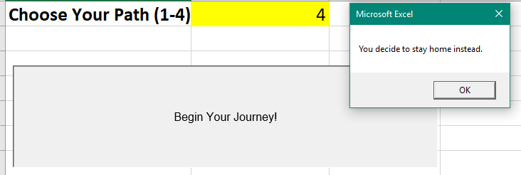
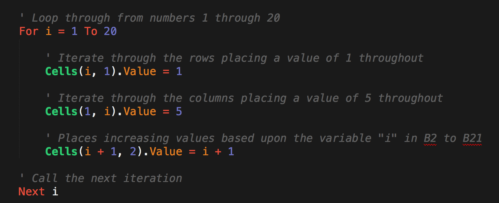
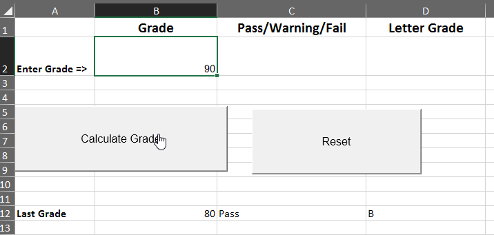
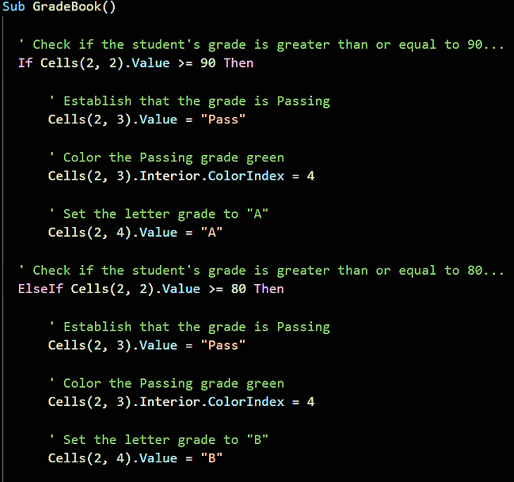
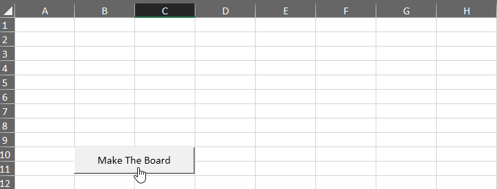

# Module 2: Virtual Class (Required) Lesson Plan

### Overview

Today’s Virtual Class (Required) lesson will review the fundamental building blocks of code, using VBA macros to automate calculations and tasks, implementing logic in VBA macros, and using VBA macros to format Excel worksheets. This lesson builds upon the weekly materials covered in “Module 2: VBA of Wall Street” to cement and extend the topics covered into new contexts. 

### Learning Objectives

At the end of the session, learners will be able to:
* Demonstrate the use of variables and arrays in VBA
* Control program flow with conditionals and loops
* Demonstrate nested for-loops and/or conditionals
* Demonstrate the value of VBA to extend Excel’s functionality
* Identify and use design patterns
* Analyze a problem and create VBA code to solve that problem
* Create interactivity with buttons
* Format cells in Excel with VBA

- - - 

### 0. Class Do: Interview Question Warm-Up (5 mins before class, first 2 mins of class) 
Open the [slideshow](https://docs.google.com/presentation/d/1mtVdX6045hBkkuFV3wx992fJMLqhiMlDC9w9GV6Ckfc/edit?usp=sharing) for today's class and begin the weekly presentation with the first slide.The first slide displays an interview question that a student may encounter based on the content of this week's content. 

**This week's question:** Could we have performed this stock analysis without VBA using Excel alone? How did we benefit by using VBA?

Allow the question to be on the screen 5 mins prior to the start of class as students join the session. Allow the class 1 minute at the start of class to review, then you will ask for a student to volunteer their answer to the question. Next, offer the answer or a few approaches you would take for answering the question.

**Possible answers to this week's question:** Yes, the analysis could have been done by hand in Excel, but the analysis is faster with VBA. Also, doing the analysis by hand would likely introduce errors, whereas the VBA method is consistent and accurate. Also, the VBA code can be reused to quickly perform the same analysis on new data.

### 1. Instructor Do: Temperature Check (15 mins)
Using the [Zoom Polling](https://support.zoom.us/hc/en-us/articles/213756303-Polling-for-Meetings) feature or a [Poll Everywhere](http://www.polleverywhere.com), launch a poll of the class to identify areas that they would like to review from the week's asynchronous content. 

**Poll Text:** 

*Select all of the topics that you feel prepared to apply outside of the class from this week's lesson:*
* *Variables/Arrays*
* *Data types*
* *For-loops*
* *Conditional for-loops*
* *Nested for-loops* 
* *Cells and Ranges*
* *Formatting with VBA*
* *Creating buttons*

Based on the results of the poll, advance to the correct slide for a review of the topics with the lowest scores. Choose 2 topics at minimum to review, or more as time permits to review.

* Variables/Arrays (Do activities in section **A**)
* Data types (Do activities in section **A**) 
* Conditionals (Do activities in section **B**)
* For-loops (Do activities in section **B**)
* Conditional for-loops (Do activities in section **B**)
* Nested for-loops (Do activities in section **B**)
* Cells and Ranges (Do activities in section **A**)
* Formatting with VBA (Do activities in section **C**)
* Creating buttons (Do activities in section **C**)

It is anticipated that nested for-loops will garner the most votes. 

## A. Cells and Ranges, Variables/Arrays, and DataTypes
### A1. Instructor Do: Cells And Ranges (0:07)

* Open the files found in [A01-Ins_CellsAndRanges/Solved/cells_and_ranges.xlsm](Activities/A01-Ins_CellsAndRanges/Solved/cells_and_ranges.xlsm) and run the `CellsAndRanges` macro -- you can run it from the VBA editor, or by navigating to the Tools --> Macro --> Macros... menu from your workbook. Be sure you clear out the contents of Sheet1 before you run the macro so you can see its effect. As you run the macro, explain to students that:

  * VBA provides two primary ways to modify the contents of spreadsheet: `Cells` and `Ranges`.

  * `Ranges` provide a more customary excel-based method for specifying cells of a spreadsheet. Ranges can be contiguous (e.g. `"F5:F7")`) or non-contiguous (e.g. `"R2,D2")`).

  * `Cells` provide a numeric coordinate-based method for referencing cells of a spreadsheet. Point out to students that `Cells` are organized in a `(Row, Column)` format where integers 1, 2, 3 denote columns A, B, C.

  * `.Value` is a method we add to the end of our `Cell` / `Range` references to specify that we want to change the content value of these cells. This is worth noting, because it will ease their realization that `Cells(X, X)` isn't just capturing the contents of the cell, but rather the entire "Cell Object" -- and with it, the formatting, style, and other aspects of the cell beyond the contents itself.

  * Cells only allow a developer to capture a single cell at a time, while Ranges allow us to capture multiple cells at once. For this reason Ranges are used more often, but it can be especially useful to refer to Cells in "loop-based" programs because we can iterate the coordinates and manipulate the cells that are referenced. Let students know that they will get time to work on this concept as the week progresses.

  * Answer any questions that remain, before sending out the .xlsm file to students.


### A2. Students Do: Chess Board  (0:15)

* Next, proceed to the next student example. Open the solution file [Activities/A02-Stu_ChessBoard/Solved/chessboard.xlsm](Activities/A02-Stu_ChessBoard/Solved/ChessBoard.xlsm) and run the macro. Show students that in this example, they will be populating a chessboard with chess pieces using a combination of `Cells` and `Ranges`.


* Then send students the following:

  * **File:**

    * [ChessBoard.png](Activities/A02-Stu_ChessBoard/Images/ChessBoard.png)

    * [ChessBoard_Unsolved.xlsm](Activities/A02-Stu_ChessBoard/Unsolved/ChessBoard.xlsm)

  * **Instructions:**

    * Populate the Chess Board provided with text-based chess pieces. For the top-half of the chess board use Ranges, for the bottom-half of the chess board use Cells.

  * **Hint:**

    * Remember that with `Ranges`, it is possible to modify multiple cells at once.

### A3. Instructor Do: Review Chess Board (0:07)

* **File:** [Activities/A02-Stu_ChessBoard/Solved/ChessBoard.vbs](Activities/A02-Stu_ChessBoard/Solved/ChessBoard.vbs)

* Once time is up, open the solution file and walk students through the code. Begin by running through the `Range` examples for the top cells, before proceeding to the bottom half. In particular, point out how we used the syntax of `Range("A1", "H1")` to place multiple pieces at once.

* As you discuss the solution, look for opportunities to engage students and ask them pointed questions.


### A4. Instructor Do: Variables  (0:07)

* Next, transition to introducing variables. Begin your introduction by reminding students that variables are named items in programming. They can store strings (text), numerics (integers and doubles for decimals), booleans (true/false), and more. Then open the Variables script in [A03-Ins_Variables/Solved/variables.vbs](Activities/A03-Ins_Variables/Solved/Variables.vbs).

* Walk students through each of the examples:

  * Point out that VBA uses the single quote (`'`) to denote a comment: everything following it is just for humans.

  * Begin your discussion by breaking down the VBA syntax for creating variables. Explain that we create (declare) variables by using the `Dim` keyword followed by the name of the variable and the type `As String`.

  * Point out that we can then utilize these variables using their names.

  * We can "concatenate" strings by combining them together and we can perform mathematical functions by combining numeric variables with operators.

  * We can further use these variables to set the value of our cells.

  * Lastly, we can combine numerics and strings by first "casting" our numerics into string format using the `Str()` method. (Similarly, we can cast strings into integers using the `Int()` method)

  * See if there any questions, before running the script and proceeding to share it with students.

  

### A5. Students Do: TypeRighter (0:10)

Send the following files and instructions to students

* Files

  * [A04-Stu_TypeRighter/Unsolved/typerighter-unsolved.xlsm](Activities/A04-Stu_TypeRighter/Unsolved/typerighter-unsolved.xlsm)
  * [A04-Stu_TypeRighter/Unsolved/typerighter.vbs](Activities/A04-Stu_TypeRighter/Unsolved/typerighter.vbs)

* Instructions

  * Five variables have been created, but they’re declared as Object types, so the lines of code assigning values to them are causing errors!

  * For each variable, change the data type in its Dim statement so that the code will run without errors.

  * Hint: a list of VBA data types can be found in the [official documentation](https://docs.microsoft.com/en-us/office/vba/language/reference/user-interface-help/data-type-summary)

### A6. Instructor Do: Review TypeRighter (0:05)

Open [A04-Stu_TypeRighter/Solved/typerighter.vbs](Activities/A04-Stu_TypeRighter/Solved/typerighter.vbs) and go through each line, explaining what the correct data type is for each variable.

### A7. Instructor Do: Arrays (0:07)

* Proceed to the next example in introducing arrays. Remember to emphasize that the goal of this week for students is _not_ merely to master the syntax of VBA, rather to learn about fundamental building blocks across programming languages. In this case, arrays are an extremely common building block across programming languages.

* Open the script in [Activities/A05-Ins_Arrays/Solved/simple_arrays.xlsm](Activities/A05-Ins_Arrays/Solved/simple_arrays.xlsm) and walk students through the code. As you do so, point out that:

  * Arrays use zero-based numbering (0-indexed), meaning that the first element is 0. Explain that zero-based numbering is a common paradigm across programming languages (Python, JavaScript, etc.).

  * We created an array called `Ingredients` to hold six strings but because of zero indexing five is passed in. For example (0,1,2,3,4,5) is six spots in the array.

  * We then added elements to this array using the `Ingredients(X)` syntax.

  * We then retrieved these values by referencing our array with the index number.

  * Answer any questions that emerge before sending students this file and proceeding to the next example.


### A8. Student Do: Countdown (0:10)

In this exercise, students will use an array to reverse the values in a column.

Open the solved workbook: [A06-Stu_Countdown/Solved/countdown-solved.xlsm](Activities/A06-Stu_Countdown/Solved/countdown-solved.xlsm) and run the `reverse()` macro to show students that it reverses the values of the cells in A1 to A5.

Then send the following instructions and files to students:

* Files

  * [A06-Stu_Countdown/Unsolved/countdown.vbs](Activities/A06-Stu_Countdown/Unsolved/countdown.vbs)

  * [A06-Stu_Countdown/Unsolved/countdown-unsolved.xlsm](Activities/A06-Stu_Countdown/Unsolved/countdown-unsolved.xlsm)

* Instructions

  * Using the starter code provided, store the values in the cells A1:A5 into `myArray`.

  * Then change the value in A1:A5 to display in reverse order.

  * Run the macro to make sure it works correctly.

### A9. Instructor Do: Review Countdown (0:05)

* Open [A06-Stu_Countdown/Solved/countdown.vbs](Activities/A06-Stu_Countdown/Solved/countdown.vbs) and step through each line of code.

## B. Conditionals, For-loops and Advanced For-loops

### B1. Instructor Do: Conditionals (0:07)

* Next open the files found in [B01-Ins_Conditionals](Activities/B01-Ins_Conditionals/Solved). Use these examples to walk students through the concept of conditionals in VBA. As you do so, be sure to point out:

  * That VBA conditionals introduce a real benefit over traditional Excel formulas. Gone are the days of having to squeeze conditionals into a single Excel formula, with VBA comes cleaner syntax and more nuanced conditionals.

  * In VBA, the syntax for conditionals involves: `If` `Then` and `End If`. Additional keywords include `ElseIf` and `Else`.

  * In VBA, we can combine conditions using the keywords `And` and `Or`.

  * Finally, send these files to students so they can reference them for the final example.

```vb
  ' Simple Conditional Example
  ' ------------------------------------------
  If Range("A2").Value > Range("B2").Value Then
      MsgBox ("Num 1 is greater than Num 2")
  End If

  ' Simple Conditional with If, Else, and Elseif
  ' ------------------------------------------
  If Range("A5").Value > Range("B5").Value Then
      MsgBox ("Num 3 is greater than Num 4")

  ElseIf Range("A5").Value < Range("B5").Value Then
      MsgBox("Num 4 is greater than Num 3")

  Else
      MsgBox("Num 3 and Num 4 are equal")

  End If
```

### B2. Students Do: Choose Your Story  (0:05)

* **Readme**: [Activities/B02-Stu_ChooseYourStory/README.md](Activities/B02-Stu_ChooseYourStory/README.md)

* If time permits, begin the final exercise of the day. In this exercise, students are tasked with creating a simple game that outputs a message box based on the user's input number.



* Send the following instructions:

  * **Instructions:**

    * Create a simple Excel workbook and VBA macro in which a user is provided a single button to click. Based on the number they provide in a text box above, a different message box will appear.

      * If the user enters a value of 1, display: "You choose to enter the wooded forest of doom!"

      * If the user enters a value of 2, display: "You choose to enter the fiery volcano of doom!"

      * If the user enters a value of 3, display: "You choose to enter the terrifying jungle of doom!"

      * If the user enters anything else, display: "You decide to stay home instead"

### B3.  Instructor Do: Review Choose Your Story (0:05)

* Once time is up, use the solution file found in [B02-Stu_ChooseYourStory](Activities/B02-Stu_ChooseYourStory) to guide students. Remind students of VBA conditional syntax and walk them through the simple logic.

* Answer any remaining questions, before providing students with the solution.

```vb
  ' Use conditionals to change message box based on user input
  If (Range("B1").Value = 1) Then
      MsgBox("You choose to enter the wooded forest of doom!")

  Elseif (Range("B1").Value = 2) Then
      MsgBox("You choose to enter the fiery volcano of doom!")

  Elseif (Range("B1").Value = 3) Then
      MsgBox("You choose to enter the terrifying jungle of doom!")

  Elseif (Range("B1").Value = 4) Then
      MsgBox("You choose to enter the bathroom")

  Else
      MsgBox("Try following directions")

  End If
```

### B4. Instructor Do: For Loop   (0:07)

* **File**:

  * [Activities/B03-Ins_ForLoops/basic_for_loop.vbs](Activities/B03-Ins_ForLoops/Solved/basic_for_loop.vbs)
  * [Activities/B03-Ins_ForLoops/basic_for_loop.xlsm](Activities/B03-Ins_ForLoops/Solved/basic_for_loop.xlsm)

* Next, you'll be introducing for-loops. Walk students through the code and run the VBA script. This code, quite simply inserts a series of numbers across rows and columns.

* In explaining the code be sure to note the parts of a VBA for loop:

  * `For i = 1 to 20` specifies the range to loop through.

  * Subsequent uses of `i` change with the loop

  * `Next i` iterates to the next value of `i`.

* Spend a few extra moments in your discussion to have students guess how the spreadsheet will look before running the code. In particular, challenge them to understand why `Cells(i, 1)` creates entries across rows and `Cells(1, i)` create entries across columns.



* Once you feel confident in their understanding, provide them with your code.

### B5. Students Do: Chicken Nugget Loop  (0:10)

* **Files:**

  * [Activities/B04-Stu_ChickenNuggets/README.md](Activities/B04-Stu_ChickenNuggets/README.md)

* Proceed with the next student exercise. In this example, students create a basic VBA script that prints "I will eat `i` Chicken Nuggets," where the value of `i` changes within the for loop.

* Show students what happens after the code runs, before sending them the instructions.

* **Instructions:**

  * Create a `For` loop that will produce the following example. (Note: The lines signify new cells.)

    | A1         | B1 | C1              |
    |----------|:-------------:|------:|
    | I will eat | 11 | Chicken Nuggets |
    | I will eat | 12 | Chicken Nuggets |
    | I will eat | 13 | Chicken Nuggets |
    | I will eat | 14 | Chicken Nuggets |
    | I will eat | 15 | Chicken Nuggets |
    | I will eat | 16 | Chicken Nuggets |
    | I will eat | 17 | Chicken Nuggets |
    | I will eat | 18 | Chicken Nuggets |
    | I will eat | 19 | Chicken Nuggets |
    | I will eat | 20 | Chicken Nuggets |

### B6. Instructor Do: Review Chicken Nuggets Loop (0:05)

* **Files**:

  * [Activities/B04-Stu_ChickenNuggets/Solved/chicken_nuggets.vbs](Activities/B04-Stu_ChickenNuggets/Solved/chicken_nuggets.vbs)

  * [Activities/B04-Stu_ChickenNuggets/Solved/chicken_nuggets.xlsm](Activities/B04-Stu_ChickenNuggets/Solved/chicken_nuggets.xlsm)

* Once the timer is done, review the exercise with students.

* As you are doing so, be sure to point out the following:

  * We created a for loop that iterates from 1 through 10.

  * We set the value of `(i, 1)` and `(i, 3)` to be fixed value of "I will eat " and "Chicken Nuggets"

  * We set the value of `(i, 2)` to be `i +10`. This forces the loop to print 11 through 20.

  * Lastly, we use `Next i` to signal we are done with the loop and onto the next one.

  

* Ask if there are any questions before proceeding to the next example.

### B7. Instructor Do: Loop Conditionals  (0:10)

* **Files**:

  * [Activities/B05-Ins_LoopConditionals/Solved/conditional_loops.vbs](Activities/B05-Ins_LoopConditionals/Solved/conditional_loops.vbs)
  * [Activities/B05-Ins_LoopConditionals/Solved/conditional_loops.xlsm](Activities/B05-Ins_LoopConditionals/Solved/conditional_loops.xlsm)

* Next, introduce one of the most important concepts of this week: Looped Conditionals. As a proficient developer, this will be a simple concept to you, but do not underestimate how critical it is for students to grasp.

* Open [Activities/B05-Ins_LoopConditionals/Solved/conditional_loops.vbs](Activities/B05-Ins_LoopConditionals/Solved/conditional_loops.vbs) and walk students through the code. Have them guess what it will do, before running the code.

* Then explain it line by line.

  * Start by pointing out the basic for loop structure.

  * Then introduce the concept of the modulus to determine remainder.

  * Point out that we are using if-else statements to route the flow of logic depending on whether `i` is even or odd.

  * Point out that we need to include the `End If` and also the `Next i` to close each respective block.


* Check if there are any questions before slacking out the solution.

### B8. Students Do: Fizz Buzz  (0:20)

* **Files**:

  * [Activities/B06-Stu_FizzBuzz/README.md](Activities/B06-Stu_FizzBuzz/README.md)
  * [Activities/B06-Stu_FizzBuzz/Unsolved/fizzbuzz.xlsm](Activities/B06-Stu_FizzBuzz/Unsolved/fizzbuzz.xlsm)

* Fizzbuzz is a very popular logic problem in coding. Inform students that this next exercise is a classic problem in technical interviews -- across all programming languages. Run the code once for them so they can see how it works.


* Explain at a high-level, the rules of the exercise:

  * If a number is divisible by just 3, then the code should print Fizz.

  * If a number is divisible by just 5, then the code should print Buzz.

  * If a number is divisible by both 3 and 5, then the code should print FizzBuzz.

* Then send students the instructions to the exercise:

* **Instructions:**

  * Create a VBA Script that populates the second column with the word "Fizz", "Buzz", or "Fizzbuzz" based on the value in the first column.

  * If the value in column 1 is a multiple of both 3 and 5, print "Fizzbuzz" in column 2.

  * If the value in column 1 is a multiple of just 3, print "Fizz" in column 2.

  * If the value in column 1 is a multiple of just 5, print "Buzz" in column 2.

### B9. Instructor Do: Review Fizz Buzz (0:10)

* **Files:**

  * [Activities/B06-Stu_FizzBuzz/Solved/fizzbuzz.vbs](Activities/B06-Stu_FizzBuzz/Solved/FizzBuzz.vbs)

  * [Activities/B06-Stu_FizzBuzz/Solved/fizzbuzz.xlsm](Activities/B06-Stu_FizzBuzz/Solved/fizzbuzz.xlsm)

* Then walk students through the solution. As you do so, be sure to explain:

  * That we started the exercise by creating a basic for loop.

  * We then created a variable to track the value of the number in column 1.

  * We then created a series of if-then statements. We started these by checking for numbers that are both divisible by 3 and 5. It is important to start here, because if-then statements move from least specific to most specific. (i.e. If a number is divisible by 3 and 5, it is also divisible by 3. We have to make sure our code handles the more specific scenario first). Let them know that this isn't an obvious solution, but rather something that emerges as you approach your code.

  * Each of our if-then statements triggers a change to `Cells(i, 2)` (column 2).

```vb
  ' Loop through the values in Column 1
  For i = 2 To 100

      'Set cell value to variable
      num = Cells(i, 1).Value


      ' Check if the number is divisible by 3 and 5....
      If (num Mod 3 = 0 And num Mod 5 = 0) Then

          ' If so, print Fizzbuzz
          Cells(i, 2).Value = "Fizzbuzz"

      ' Check if the number is divisible by just 3...
      ElseIf (num Mod 3 = 0) Then

          ' If so, print "Fizz"
          Cells(i, 2).Value = "Fizz"

      ' Check if the number is divisible by just 5...
      ElseIf (num Mod 5 = 0) Then

          ' If so, print "Buzz"
          Cells(i, 2).Value = "Buzz"

      End If

  Next i
```

### B10. Instructor Do: Nested For Loops (0:10)

* **Files**:

  * [Activities/B07-Ins_NestedForLoops/Solved/nested_for_loop.vbs](Activities/B07-Ins_NestedForLoops/Solved/nested_for_loop.vbs)

  * [Activities/B07-Ins_NestedForLoops/Solved/nested_for_loop.xlsm](Activities/B07-Ins_NestedForLoops/Solved/nested_for_loop.xlsm)

* Proceed now to the final instructor demo: Nested for-loops. Like looped conditionals, this is an extremely important concept and one that leaves students easily confused. Encourage them to focus on this section.

* Walk students through the spreadsheet and code. Point out that in this example, we are looking to loop through both the rows and columns. Try to highlight cells as you try to simulate the actions of each loop. Begin at the top left, move across the columns, before proceeding to the next row.

* Encourage students to re-do this process themselves to one another before moving on to the next exercise.

* 

### B11. Students Do: Stars Counter (0:15)

* Start today's class off with a short warm-up and review of what we covered during our last two meetings.

* We'll be slacking out to students an Excel spreadsheet containing 50 rows of "review data" for Spanish and French online language programs. Using their knowledge of VBA, it is up to them to determine the total number of stars each user gave their respective programs and then find the total number of stars both programs received.


* **Files**

  * [StarCounter_Unsolved/star_counter.xlsm](Activities/B08-Stu_StarsCounter/Unsolved/star_counter.xlsm)

* **Instructions**

  * Create a VBA Script that tallies the number of "Full Stars" per row and enters them into the Total column. Starter Code is provided, but feel free to start from scratch if you want an extra challenge :-)

* **Bonus**

  * Instead of hard-coding the last number of the loop, use VBA to determine the last row automatically (i.e. do not use for i = 2 to 51)

  * Create two charts:

    * One to see if there is a relationship between Program Type and Rating (Bar Chart)

    * The other to see if there is a relationship between Date and Rating (Line Graph)

* **Hints**

  * You will need to use a nested for loop.

  * You will need to create a variable to hold the number of stars and continually reset this variable at the start of each row.

### B12. Instructor Do: Review Star Counter (0:05)

* Open up [B08-Stu_StarsCounter/StarCounter_Solved_WithVBA](Activities/B08-Stu_StarsCounter/Solved/star_counter_with_VBA.xlsm) and run through the code with your class, fielding whatever questions they may have.

* In your discussion of the basic solution make sure to point out the following:

  * The code loops through rows 2 to 51 in our first loop

  * It then loops through columns 4 to 8 for that row within the second loop

  * Every time we find a "Full-Star" value within a column, we add one to our `StarCounter`

  * The value of `StarCounter` is placed within a new cell after the conclusion of the second loop and then we move onto the next value in the first loop

  

  * To count all of the stars on the page, all that needs to be added is another variable, add to it just like `StarCounter`, and then not reset it on each new row.

## C. Creating Buttons and Formatting with VBA
### C1. Instructor Do: Button Clicks  (0:07)

* **Files**: [C01-Ins_ButtonClicks](Activities/C01-Ins_ButtonClicks)

* Next, return to the Developer tab to show students how to add a button to their spreadsheet. The Mac view is slightly different, so be sure to patiently support students on both operating systems.

* Once the button is created, you will be asked to "Assign a Macro to the button. You can choose to create a new macro or select a pre-existing one. If you accidentally close this window, you can always return to it by right-clicking your button and selecting "Assign Macro". If you are using the Excel file provided in [C01-Ins_ButtonClicks](Activities/C01-Ins_ButtonClicks), you will see that the button is associated with a macro that simply prints: "You clicked me" when pressed.


### C2. Students Do: Choose Your Button (0:07)

* **Readme**: [Activities/C02-Stu_ChooseYourButton/README.md](Activities/C02-Stu_ChooseYourButton/README.md)

* Next, open the Excel file in [Activities/C02-Stu_ChooseYourButton/Solved/choose_your_button.xlsm](Activities/C02-Stu_ChooseYourButton/Solved/choose_your_button.xlsm) and run the macro. Show students that for the next exercise, they will be running a subroutine of their own to trigger two buttons that elicit different messages when clicked.

* Send the following instructions for them to complete:

  * **Instructions**

    * Create an Excel file with two interactive buttons. These buttons should each be associated with a different VBA subroutine. When clicked, each button should trigger a different pop-up message.

    * If you finish early, ensure the people around you complete the task as well.

### C3. Instructor Do: Review Choose Your Button  (0:05)

* Once time is complete, open the solution file in [Activities/C02-Stu_ChooseYourButton/Solved/choose_your_button.vbs](Activities/C02-Stu_ChooseYourButton/Solved/choose_your_button.vbs). Walk students through the VBA script. As you do so, point out:

  * That we created two VBA subroutines, one for each button.

  * Return to the Excel solution file and point out that each button is associated with a different subroutine.

  * Answer any questions, before proceeding to the next example.


### C4. Instructor Do: VBA Formatting (0:05)

* Not only can we use VBA to change the values within cells, but we can also code in formatting fairly easily using a variety of functions.

  

* Open up [C03-Ins_Formatter/formatter.xlsm](Activities/C03-Ins_Formatter/Solved/formatter.xlsm) within Excel and explain to your students how we will be using VBA to fill each of these cells with their respective colors.

  * Within the VBA editor, write the following code...

  ```vb
  Sub formatter()

    ' Set the Font color to Red
    Range("A1").Font.Color = vbRed

    ' Set the Cell Colors to Red
    Range("A2:A5").Interior.Color = vbRed

  ```

* Check with to see if your students can guess what this code will do when run.

  

  * The text in cell A1 will be colored red

  * The interiors of cells A2 to A5 will be filled with red as well

* Now have your students help you create the code that will color columns B, C, and D.

  

  * Point out how the code is mostly the same as painting the cells red with the only values changing being the cells referenced and the color value.

* Check with your students to see if they have any questions regarding VBA formatting before moving onto the next activity.

### C5. Students Do: VBA Grade Book (0:15)

* Now your students are going to create an Excel application that checks a fictional student's grade and performs some actions based upon it.

  

* Once you have shown your students an example of how this application will function, slack out the starter file and instructions.

* **Files**

  * [GradeBook_Unsolved/grader.xlsm](Activities/C04-Stu_Gradebook/Unsolved/grader.xlsm)

* **Instructions**

  * Using `grader.xlsm` as a starting point, create a grade calculator using **conditionals**. This calculator will convert a student's numeric grade into a letter grade, and style the resulting cell accordingly.

  * Once complete your script should perform the following:

    * If the score is over 90, the student will receive an "A" in the letter grade cell, and the Pass/Warning/Fail cell will be filled green with the text "Pass."

    * If the score is between 80 and 89 (inclusive), the student will receive a "B" in the letter grade cell, and the Pass/Warning/Fail cell will be filled green with the text "Pass."

    * If the score is between 70 and 79 (inclusive), the student will receive a "C" in the letter grade cell, and the Pass/Warning/Fail cell will be filled yellow with the text "Warning."

    * Finally, if the score is below a 70, the student will receive an "F" in the letter grade cell, and the Pass/Warning/Fail cell will be filled red with the text "Fail."

* **Bonus**

  * Create a second button that resets the grades to the original state and then establishes the previous grade in a row labeled "Last Grade."

  * Hint: the built-in color value for no fill is `xlNone`

### C6. Instructor Do: Review Grade Book (0:05)

* Open up [C04-Stu_Gradebook/graderSolved.xlsm](Activities/C04-Stu_Gradebook/Solved/grader.xlsm) and run through the code with your class, fielding whatever questions they may have.

* In your discussion of the solution make sure to point out the following:

  * Point out how you are modifying the formatting/value of cells B2/C2 based upon the value stored within A2. When the value of A2 changes, so too does the formatting/value of cells B2/C2.

  * Due to the number of possible inputs, our code includes plenty of conditionals to account for every new letter grade.

  * For the bonus, the code only needs to collect the previous values of A2, B2, and C2 before moving them into three new cells, then clear the information held in row 2.



- - - 
## BREAK - (0:05)
- - -
    
### 2. Instructor Do: Safety Net Survey - Nested For-loop Milestone (5 mins)
Using the [Zoom Polling](https://support.zoom.us/hc/en-us/articles/213756303-Polling-for-Meetings) feature or a [Poll Everywhere](http://www.polleverywhere.com), launch a poll of the class to ask questions about nested for-loop use cases.

Example use cases:
* Scanning through a table by rows and then by columns
* Drive a repeated loop (the inner loop) by the values in a list (i.e. the values from the outer loop)

### 3. Partners Do: Checkerboard (0:15)

* While this next activity does involve VBA formatting, the core goal is to help teach students coding logic.

* Students must create an 8x8 checkerboard pattern using nothing but VBA scripts. This means creating a script which formats cells based upon whether they are determined to be even or odd. Open [01-Stu_Checkerboard/checkerboard_solved.xlsm](Activities/01-Stu_Checkerboard/Solved/checkerboard.xlsm) and demo what the solution should look like.

  

* Students will need to use the modulus function for this activity. Open [01-Stu_Checkerboard/Unsolved/modulus.vbs](Activities/01-Stu_Checkerboard/Unsolved/modulus.vbs) and explain that the modulus essentially performs long division on a number and returns the remainder (Note that in VBA modulus is denoted by `Mod`). Run the code in [01-Stu_Checkerboard/Unsolved/modulus.xlsm](Activities/01-Stu_Checkerboard/Unsolved/modulus.xlsm)

* Slack out the following instructions and explain the activity, then create breakout rooms of 2-3 students to work together on this task.

* **Instructions**

  * Using VBA scripts, create an 8x8 grid with alternating red and black squares.

* **Hints**

  * You will need to use nested for loops, conditionals, mods, and formatting to create the board.

  * This is a tricky problem! Try to pseudocode a plan first.

    * Unlike previous activities, this activity can be solved in a multitude of different ways. While some methods may be more efficient than others, simply finding a solution to the problem is a great start!