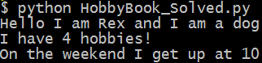
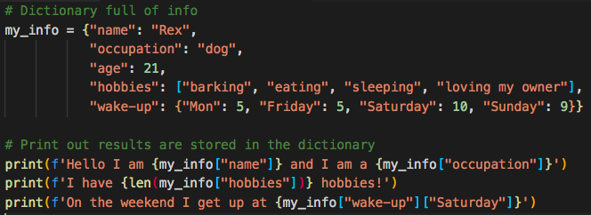
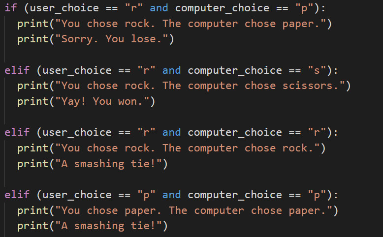
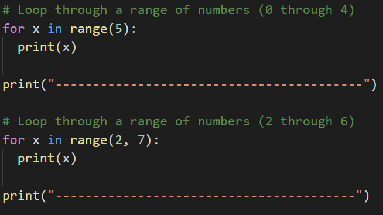
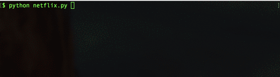
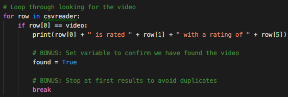
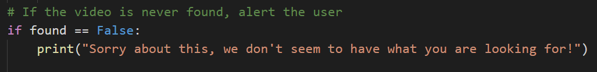
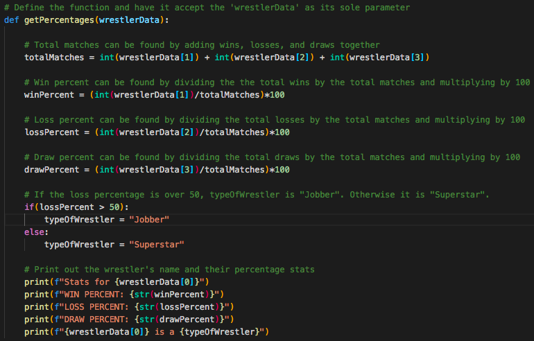

# Module 3: Virtual Class (Required) Lesson Plan

## Overview

Today's Virtual Class (Required) lesson will review the fundamental building blocks of code in the context of Python, how to read and write files with Python and the csv module, and use git from the command line. This lesson builds on the weekly materials covered in “Module 3: PyPoll” to cement and extend the topics covered in new contexts.

## Learning Objectives

At the end of the session, learners will be able to:
 
* Demonstrate the use of variables, lists, and dictionaries.

* Control program flow with conditionals and loops in Python.

* Read and write files, including CSV files.

* Create basic Python functions

* Create basic list comprehensions

* Use git in the command line to clone, pull from, and push to repositories. 

- - -

### 0. Class Do: Interview Question Warm-Up (5 mins before class, first 2 mins of class) 

Open [the slideshow](https://docs.google.com/presentation/d/1xs2XJma83-D61kfNP3NIlAM0S88vfGW6WVo0xdtcHC4/edit?usp=sharing) for today's class and begin the weekly presentation with the first slide. The first slide displays an interview question that a student may encounter based on the content of this week's content. 

**This week's question:** How is Python different from VBA? How are they similar?

Allow the question to be on the screen 5 mins prior to the start of class as students join the session. Allow the class 1 minute at the start of class to review, then you will ask for a student to volunteer their answer to the question. Next, offer some other comparisons between the two languages.

**Possible answers to this week's question:**

* Python runs in the command line, VBA runs in Excel
* Python uses indentation to mark code blocks, VBA uses “End” and “Next”
* They both use variables, arrays/lists, conditionals, and functions
* They’re both programming languages
*  They’re both interpreted, not compiled

### 1. Instructor Do: Temperature Check (15 mins)
Using the [Zoom Polling](https://support.zoom.us/hc/en-us/articles/213756303-Polling-for-Meetings) feature or a [Poll Everywhere](http://www.polleverywhere.com), launch a poll of the class to identify areas that they would like to review from the week's asynchronous content. 

**Poll Text:**

*Select all of the topics that you feel prepared to apply outside of the class from this week's lesson:*

* *Variables*
* *Conditionals and loops*
* *Lists and dictionaries*
* *Reading text files*
* *Reading and writing CSVs*
* *List comprehensions*
* *Functions*
* *Git*

Based on the results of the poll, advance to the correct slide for a review of the topics with the lowest scores. Choose 2 topics at minimum to review, or more as time permits to review.

* Variables (Do activities in section **A**)
* Conditionals and loops (Do activities in section **B**)
* Lists and dictionaries (Do activities in section **A**)
* Reading text files (Do activities in section **C**)
* Reading and writing CSVs (Do activities in section **C**)
* List comprehensions (Do activities in section *D**)
* Functions (Do activities in section **D**)
* Git (Do activities in section **E**)

It is anticipated that list comprehensions and functions will garner the most votes.

## A. Data Structures (Variables, Lists, and Dictionaries)

### A1. Students Do: Hello Variable World! (0:10)

* To start, we create a simple Python application that uses variables. It will both run calculations on integers and print strings out to the console.

* Open up [A1-Stu_HelloVariableWorld](Activities/A1-Stu_HelloVariableWorld/Solved/HelloVariableWorld.py) within the terminal and run the code to show students how the application should function.

  

* **Instructions**

  * Create two variables called `name` and `country` that will hold strings.

  * Create two variables called `age` and `hourly_wage` that will hold integers.

  * Create a variable called `satisfied` which will hold a boolean.

  * Create a variable called `daily_wage` that will hold the value of `hourly_wage` multiplied by 8.

  * Print out statements using all of the above variables to the console.

### A2. Everyone Do: Review Hello Variable World (0:05)

* Open up the code contained within [A1-Stu_HelloVariableWorld](Activities/A1-Stu_HelloVariableWorld/Solved/HelloVariableWorld.py) and go over the solution file line by line with the class, answering whatever questions students may have.

* Key points to cover over the course of the discussion:

  * Each of the variables has to be declared individually but do not have to be cast at declaration. Python figures out data type on its own.

  * Integer variables can easily be placed into calculations simply by using their name.

  * Even though booleans look like strings, they do no use quotations in their declaration.

    

  * When traditionally printing out integers and booleans with strings, the variables must be cast as strings as well. Without casting them as strings, the console will return an error.

  ```python
  # Print out the user's age
  print("You are " + str(age) + " years old")
  ```

  * When using an f-string, integers and booleans do not need to be cast as strings. Also, the syntax is slightly different: variables are enclosed in curly braces, there are no plus signs, and a single set of quotation marks around the entire string.

  ```python
  # With an f-string, print out the daily wage that was calculated
  print(f"You make {daily_wage} per day")

  # With an f-string, print out whether the users were satisfied
  print(f"Are you satisfied with your current wage? {satisfied}")
  ```
### *A3. Instructor Do: Variables (0:05) (Optional)*

* If students need more examples to understand variables, continue with this optional activity.

* Open up the file [variables.py](Activities/A2-Ins_Variables/Solved/variables.py) and explain to students that variables let us store information that we can later use.

  * Remind students how VBA accessed certain values when they referred to a specific cell. This is essentially what a variable is doing in Python, a value is being stored there.

* Show the students the code and explain the following...

  * Variables can store different data types like strings, integers and an entirely new data type called booleans which hold `True` or `False` values.

    ```python
    # Creates a variable with a string "Frankfurter"
    title = "Frankfurter"

    # Creates a variable with an integer 80
    years = 80

    # Creates a variable with the boolean value of True
    expert_status = True
    ```

  * We can print statements which include variables, but traditional Python formatting won't concatenate strings with other data types. This means integers and booleans must be cast as strings using the `str()` function.

    ```python
    # Prints a statement adding the variable
    print("Nick is a professional " + title)

    # Convert the integer years into a string and prints
    print("He has been coding for " + str(years) + " years")

    # Converts a boolean into a string and prints
    print("Expert status: " + str(expert_status))
    ```

  * Alternatively, the "f-string" method of string interpolation allows strings to be formatted with different data types. Demonstrate the differences by refactoring the last print statement as an "f-string":

    ```python
    # An f-string accepts all data types without conversion
    print(f"Expert status: {expert_status}")
    ```

* Slack out the following reference guide for [Python 3's f-Strings](https://realpython.com/python-f-strings/).

* Answer any questions students may have before moving onto the next activity.

### A4. Student Do: Grocery List (0:10)
* Instructions
    * Create a Python list to store your grocery list as a list of strings. You need to buy:
        * Milk
        * Bread
        * Eggs
        * Peanut Butter
        * Jelly
    * Print out the list
    * Wait! Your cousin is visiting next week, and they’re allergic to peanuts! Change “peanut butter” in the list to “almond butter”.
    * You just remembered that you have homemade jam that your neighbor made for you. Remove “jelly” from the list.
    * You just used up the last of your coffee. Add “coffee” to your grocery list.
    * Print out the updated list.

### A5. Instructor Do: Review Grocery List (0:05)
* Open up [grocery_list.py](A3-Stu_GroceryList/Solved/grocery_list.py) and walk through the code, making sure to explain the following:
    * A list can be initialized with variables.
    * Items can be accessed by their index, and values can be changed just like variables.
    * Items can be added with `append()`
    * Items can be removed with `remove()` (or `pop()`)

### *A6. Instructor Do: Lists (0:10) (Optional)*
* If students need more time with lists, do the following optional activity

  * Lists are the Python equivalent of arrays in VBA, functioning in much the same way by holding multiple pieces of data within one variable.

  * Lists can hold multiple types of data inside of them as well. This means that strings, integers, and boolean values can be stored within a single list.

* Open [lists.py](Activities/A4-Ins_List/Solved/lists.py) and explain how a list called `myList` was created that contains a mix of data types.

  * The `append` method can add elements on to the end of a list.

  * The `index` method returns the numeric location of a given value within a list.

  * The `len` function returns the length of a list.

  * The `remove` method deletes a given value from a list.

  * The `pop` method can be used to remove a value by index.

  * Remind students that indexing in lists starts at `0`.

  

* Python also has a data type called "tuples" that are functionally similar to lists in what they can store but are immutable.

  * While lists in Python can be modified after their creation, tuples can never be modified after their declaration.

  * Tuples tend to be more efficient to navigate through than lists and also protect the data stored within from being changed.

  * For more info on tuples, have your students check this [quora question](https://www.quora.com/What-advantages-do-tuples-have-over-lists) out.

  

* Answer any questions students may have about lists before moving onto the next activity.

### A7. Students Do: Hobby-Book (0:15)

* Next the students will get practice with creating and accessing their own dictionaries based upon their hobbies.

* Open up [A4-HobbyBook](Activities/A4-Stu_HobbyBook/Solved/HobbyBook_Solved.py) within the terminal and run the code to show the end results of the application.

  

* **Instructions:**

  * Create a dictionary that will store the following:

    * Your name
    * Your age
    * A list of a few of your hobbies
    * A dictionary of a few days and the time you wake up on those days

  * Print out your name, how many hobbies you have and a time you get up during the week.

### A8. Instructor Do: Review Hobby-Book (0:05)

* Open up [A5-HobbyBook](Activities/A5-Stu_HobbyBook/Solved/HobbyBook_Solved.py)  and walk through the code, making sure to explain the following:

  * A variable called `my_info` stores the primary dictionary as noted by the curly braces.

  * The keys are "name", "occupation", "age", "hobbies" and "wake-up". Their values are what is stored after the colons with each new key-value pair being separated by a comma.

  * In order to find the number of values stored within the "hobbies" key, the `len()` function is used.

    

### *A9. Instructor Do: Dictionaries (0:05) (Optional)*

* If students need more time on dictionaries, do the following optional activity

* Another data type that is commonly used in Python the dictionary, a.k.a. "dict".

  * Like lists and tuples, dictionaries can contain multiple values and types of data within them.

  * Unlike lists and tuples, however, dictionaries store data in key-value pairs. The key in a dictionary is a string that can be referenced in order to collect the value it is associated with.

* Open up [dictionaries.py](Activities/A6-Ins_Dicts/Solved/dictionaries.py) and explain the code that is contained within. Make sure to explain the following:

  * A pair of curly braces is used to create a dictionary: `variable = {}`

  * Values can be added to dictionaries at declaration by creating a key that is stored within a string, following it with a colon, and then placing the value desired afterwards.

  * Referencing a value within a dictionary is as simple as calling the dictionary and following it up with a pair of brackets containing the key for the value desired.

    

  * Dictionaries can hold multiple pieces of information by following up each key-value pairing with a comma and then placing another key-value pair afterwards.

  * Dictionaries can also store lists. They can be accessed by first calling the key and then indexing the list. Assure students they only need a basic understanding of this for now and that when they get into APIs they will get a lot more practice.

  * Dictionaries can also contain other dictionaries. In order to access the values inside nested dictionaries, simply add another key to the reference.

    

  * It is important to note how dictionaries in Python will always auto-sort alphabetically. This means that the order in which key-value pairs were declared many not be the order they would be when printed in the console.

## B. Program Flow (Conditionals and Loops)

### B1. Students Do: Conditional Conundrum (0:10)

* During this activity, students will be looking through some pre-written conditionals and attempting to figure out what lines will be printed to the console.

* **File:**

  * [conditionals_unsolved.py](Activities/B1-Stu_ConditionalConundrum/Unsolved/conditionals_unsolved.py)

* **Instructions:**

  * Look through the conditionals within the provided code and figure out which lines will be printed to the console.

  * Do not run the application at first, see if you can follow the thought process for each chunk of code and then place a guess. Only after coming up with a guess for each section should you run the application.

* **Bonus:**

  * After figuring out the output for all of the code chunks, create your own series of conditionals to test your fellow students. Once you have completed your puzzle, slack it out to everyone so they can test it.

### B2. Instructor Do: Review Conditionals Conundrum (0:05)

* Open up the code contained within [08-Stu_conditionalConundrum](Activities/B1-Stu_ConditionalConundrum/Solved/conditionals_solved.py) and go over the solution file line by line with the class, answering whatever questions students may have.

* Key points to cover during this discussion:

  * The `if` statement for the first code chunk checks whether `10 > 10`, which is false. As such the code will return "ooo needs some work".

    

  * The length of "Dog" is 3 and `x` is 5, thus making the statement for the second chunk of code true and returning "Question 2 works!"

    

  * The addition of the `and` statement to the third chunk of code means both logic tests need return `True` to run. Thankfully both do and thus "GOT QUESTION 3!" is printed.

    

  * Conditionals work by going form the top down. The logic tests in chunk four do not return as `True` until the third conditional and, as such, "Dan is in group three" is printed.

    

  * Within chunk five, one of the conditions are met in the third conditional, but it's not until getting into the `or` statement of the fourth conditional that the logic test finally returns as `True`.

    

* Slack out the solution above and then ask the class if anyone would like to share their creations from the bonus section of the activity.

  * Have students slack out their code and then explain how their conditional puzzles worked with the class.

### *B3. Instructor Do: Conditionals (0:10) (Optional)*

* If students need more time with conditionals, do the following optional activity:

* Open [conditionals.py](Activities/B2-Ins_Conditionals/Solved/conditionals.py) in a text editor and run through the code with the class.

* Students should be familiar with conditionals after their time with VBA, so explain to them that the logic in Python is nearly the same. The primary difference is the syntax and indentation.

  * Python uses `if`, `elif`, and `else` for creating conditionals (pay attention to the letter case and spelling!).

  * Conditional statements are concluded with a colon but all lines after the colon **must** be indented to be considered a part of that code block. This is because Python reads blocks of code based on indentation.

    

  * All sorts of operators like greater than, less than, equal to, and much more can be used to create logic tests for conditionals.

  * The condition `is equal to` uses `==` while variable assignment uses one equal sign.

  * Multiple logic tests can be checked within a single conditional statement. Using the term `and` must mean both tests return `True` while `or` require that only one test return as true.

  * Conditionals can even be nested, allowing programmers to run logic tests based upon whether or not the original logic test returned as `True`.

    

* Answer whatever questions the class may have before slacking out the code for students to reference during the next exercise.

### B4. Students Do: Rock, Paper, Scissors (0:15)

* During this time, students will be creating a simple game of Rock, Paper, Scissors that will run within the console.

* Open [RPS_Solved.py](Activities/B3-Stu_RockPaperScissors/Solved/RPS_Solved.py) within the terminal and run the application to show students what the game will look like.

  

* Open [RPS_Unsolved.py](Activities/B3-Stu_RockPaperScissors/Unsolved/RPS_Unsolved.py) within a text editor and tell students that this will be their starter code.

* Explain how the code imports a module called `random` that will allow the computer make a choice randomly from a list of actions.

* Mention to the class how they will be diving far more deeply into modules during the next class.

* Direct them towards the [documentation](https://docs.python.org/3.6/library/random.html) for the `random` module and explain how, by importing the random library, they will now have access to all these functions within their code.

* **Files**

  * [RPS_Unsolved.py](Activities/B3-Stu_RockPaperScissors/Unsolved/RPS_Unsolved.py)

* **Instructions:**

  * Using the terminal, take an input of `r`, `p` or `s` which will stand for rock, paper, and scissors.

  * Have the computer randomly pick one of these three choices.

  * Compare the user's input to the computer's choice to determine if the user won, lost, or tied.

* **Hints:**

  * Look into this [stackoverflow](https://stackoverflow.com/questions/306400/how-to-randomly-select-an-item-from-a-list) question for help on using the `random` module to select a value from a list.

### B5. Instructor Do: Review Rock, Paper, Scissors (0:05)

* Open up the code contained within [RPS_Solved.py](Activities/B3-Stu_RockPaperScissors/Solved/RPS_Solved.py) and go over the solution file line by line with the class, answering whatever questions students may have.

* Key points to cover when discussing this activity:

  * In the starter code, `random.choice` will pick a random choice within the `options` list for the computer and store its pick within a variable called `computer_choice`.

  * The application prompts the user for their option and stores it within a variable called `user_choice`.

  * Knowing that rock beats scissors, scissors beats paper, and paper beats rock the code can be organized into a series of conditional statements to compare the user's choice to the computer's choice.

  

### B6. Students Do: Number Chain (0:14)

* Next up is a number chain exercise that will take user input and print out a string of numbers. Feel free to add extra time to this exercise as it will be the last of the day and is critical to students understanding how loops work.

* Open [NumberChain_Solved.py](Activities/B4-Stu_NumberChain/Solved/NumberChain_Solved.py) and run the code to show the result.

  

* **Instructions:**

  * Using a `while` loop, ask the user "How many numbers?", and then print out a chain of ascending numbers from 0 to the number input.

  * After the results have printed, ask the user if they would like to continue. If "y" is entered, keep the chain running by inputting a new number and starting a new count from 0 to the number input. If "n" is entered, exit the application.

* **Bonus:**

  * Rather than just displaying numbers starting at 0, have the numbers begin at the end of the previous chain.

### B7. Instructor Do: Review Number Chain (0:04)

* Open up the code contained within [NumberChain_Solved.py](Activities/B4-Stu_NumberChain/Solved/NumberChain_Solved.py) and go over the solution file line by line with the class, answering whatever questions students may have.

* For the regular solution explain:

  * The initial value for `user_play` is set to "y" so that the `while` loop will run initially. This loop will continue to run so long as the value of `user_play` is "y" at the end of the code block.

  * An input number is asked for and then a `for` loop will then run to count from 0 to that number.

  * The user is then prompted to either enter "y" if they would like to create a new number chain or "n" if they would like to terminate the application.

    ```python
    # Initial variable to track game play
    user_play = "y"

    # While we are still playing...
    while user_play == "y":

        # Ask the user how many numbers to loop through
        user_number = input("How many numbers? ")

        # Loop through the numbers. (Be sure to cast the string into an integer.)
        for x in range(int(user_number)):

            # Print each number in the range
            print(x)

        # Once complete...
        user_play = input("Continue: (y)es or (n)o? ")
    ```

  * For the bonus solution, just add in a variable called `start_number` whose initial value is 1 and whose value will be set to the last number used in the loop after the `for` loop has completed.

  * The `for` loop will now run from the range of `start_number` to `user_number` plus `start_number`. This means that the code will always count up the inputted amount from the previous input amount.

### B8. Instructor Do: Loops (0:10) (Optional)

* The next topic, loops, was also covered during VBA but students may still struggle with grasping the syntax in Python, so make sure to field questions as you proceed through the activity.

* Open up [11-Ins_Loops](Activities/11-Ins_Loops/Solved/LoopDeeLoop.py) within a text editor and explain the following...

  * The variable `x` is created within the loop statement and could theoretically take on any name so long as it is unique.

  * When looping through a range of numbers, Python will halt the loop one number before the final number. For example, when looping from 0 to 5, the code will run five times, but `x` will only ever be printed as 0 through 4.

  * When provided with a single number, `range()` will always start the loop at 0. When provided with two numbers, however, the code will loop from the first number until it reaches one less than the second number.

    

  * Python can also loop through all of the letters within a string or all of the values stored within a list by using the syntax `for <variable> in <string or list>:`.

    

  * `while` loops will run blocks of code just like a `for` loop does but will continue looping for as long as a condition is met.

    

# C. Reading and Writing Files

### C1. Students Do: Reading Netflix (0:15)

* In this activity, students will be provided with a CSV file containing data taken from Netflix. They will then create an application which searches through the data for a specific movie/show and returns the name, rating, and review score for it.

  

* After opening up the [08-Stu_ReadNetFlix/netflix.py](Activities/08-Stu_ReadNetFlix/Solved/netflix.py) of this activity in order to show students how their application should function, slack out the following file and instructions.

* **File:**

  * [Netflix_Ratings.csv](Activities/08-Stu_ReadNetFlix/Resources/netflix_ratings.csv)

* **Instructions:**

  * Prompt the user for what video they are looking for.

  * Search through the `netflix_ratings.csv` to find the user's video.

  * If the CSV contains the user's video then print out the title, what it is rated and the current user ratings.

    * For example: `'Grease is rated PG with a rating of 86'`

* **Bonus:**

  * Insert a `break` statement into the for loop to stop the loop when the first movie is found to stop duplicated results. See the [documentation](https://docs.python.org/3.6/reference/simple_stmts.html#break) for additional info.

  * If the CSV does not contain the user's video then print out a message telling them that their video could not be found.

### C2. Everyone Do: Review Reading Netflix (0:05)

* Slack out the [08-Stu_ReadNetFlix/netflix.py](Activities/08-Stu_ReadNetFlix/Solved/netflix.py) of the previous activity and go over the code with the class, answering whatever questions they may have.

* Important topics to cover when discussing this activity:

  * Before doing anything else, Python imports both the `os` and `csv` modules for use later on. It is common practice to import all modules at the start of an application.

  * When opening up the CSV file, the code dictates that each new line in the file should be viewed as a new line of data to be read in.

  

  * When reading the CSV file, the delimiter is set to `","` to ensure Python splits up the data into the proper columns whenever a comma is found.

  * The code loops through each row, searching for the row whose first value - index 0 - is equal to that of the search term entered.

  * The rating of a video is at the index of 1 and the review score is located at the index of 5. For the bonus the `break` statement is added to end the loop once a movie is found.

  

  * The way in which the bonus operates is fairly simple. First a variable is created that stores the value `False`. If a video matching the user's search is discovered then this value is set to `True`. After the code loops through all of the data stored within the CSV, if the value is still equal to `False` then the apology message is printed to the screen.

  

### *C3. Instructor Do: Reading Text Files (0:05) (Optional)*

* Another function of Python is that it is capable of reading data in from external text files and then performing some tasks on it.

* Open up [05-Ins_BasicRead/read_file.py](Activities/05-Ins_BasicRead/Solved/read_file.py) and [05-Ins_BasicRead/Resources/input.txt](Activities/05-Ins_BasicRead/Resources/input.txt), going over the syntax and purpose of the code contained within.

  * When dealing with external files, Python requires very precise directions on what path to follow to reach the desired file. As such, if the desired file is stored within a sub-folder called "Resources", the path needed would be "Resources/FileName.txt".

  * It is critical to note that different operating systems use different paths to locate files. For example: Windows machines will often use forward slashes to separate folders while Mac devices will use backslashes.

  

  * The `with` statement is simply saying that, for as long as we are dealing with the code within the following block, save the text variable. Once the code block has completed, the text variable will be "cleaned up" and removed to save memory.

  * `open(<File Path>, <Read/Write>)` is the function Python uses in order to open up and work with external text files. By specifying either `'r'`, `'w'`, or `'rw'`, users can use the `open()` function to either read from a text file, write to a text file, or perform both operations in the code block that follows it.

  * `text.read()` parses the data that is read in by the `open()` function and converts it into a string type. If this function was not used all that would be printed to the screen would be an unhelpful text wrapper object.

  

### *C4. Instructor Do: Reading In CSV Files (0:10) (Optional)*

* While reading in text files can be useful in some circumstances, it is more likely within the data industry to run across files known as CSV files.

  * CSV stands for **Comma** **Separated** **Values** and is essentially a table that has been converted into text format with each row and column being separated by specified symbols.

  * More often than not each row is located on a new line and each column is separated by a comma. Seems simple enough since this is why the file type is called Comma Separated Values.

    

* Python has a module called `csv` which allows its users to easily pull in data from external CSV files and perform some operations upon them.

* Open up [07-ReadCSV](Activities/07-Ins_ReadCSV/Solved/read_csv.py) within the editor and go over the code contained within with the class.

  * The first major piece of code to point out is the importing and usages of the `os` module. This module allows Python programmers to very easily create dynamic paths to external files that function across different operating systems.

  

  * The second major point to make is that the code is still using the `with open()` syntax from earlier to read in the file originally. The key difference here is that this code now includes the `newline=''` parameter. This tells Python that each time the CSV file goes down a line, it should be considered a new row.

  * Instead of `text.read()`, this new code instead utilizes `csv.reader()` to translate the object being opened by Python. It is critical to note the `delimiter=','` parameter being used as this tells Python that each comma within the CSV should be seen as moving into a new column for a row.

  * Reiterate to students that the reading of the file must be done within `with open()` statement.  Outside of that block of code, the variable `csvreader` will not be useful because the file will be closed when the `with open()` block ends. In a later example, students will see that one option for working with the data outside of `with open()` is to append it to a list.

    

  * The code then loops through each row of the CSV and prints out the contents. Make sure to point out how each value is being shown as a string and how all of the rows are lists.

    

### C5. Instructor Do: Writing CSV Files (0:05)

* Not only can python read data in from CSV files, it is also wholly capable of writing data into CSV files as well.

  * While this may not seem handy at first, it allows Python users to very easily modify and/or create datasets based upon previous data.

* Open up [09-Ins_WriteCSV/write.py](Activities/09-Ins_WriteCSV/Solved/write.py) within the editor and go through the code with the class, explaining each line as you go along.

  * The syntax for writing into a CSV file is thankfully very similar to that used to read data in from an external file.

  * First, the code references the path that will point into the CSV file the user would like to write to.

  * Next, the `with open()` statement is used once more but with one significant difference. Instead of the parameter `'r'` being passed and directing Python to read a file, the parameter `'w'` is passed instead to inform Python to write to the file.

  * Instead of `csv.reader()`, `csv.writer()` is used to once again inform Python that this application will be writing code into an external CSV file.

  * To write a new row into a CSV file, simply use the `csv.writerow(<DATA LIST>)` function and pass in an array of data as the parameter.

  

* Run the code and then open up the new CSV file create to show students that the application was successful.

# D. Functions and List Comprehensions

### D1. Students Do: Functions (0:10)

* **Files**:

  * [Unsolved/main.py](Activities/07-Stu_Functions/Unsolved/main.py)

* **Instructions**:

  * Write a function called `average` that accepts a list of numbers as a single argument.

    * The function `average` should return the arithmetic [mean](https://en.wikipedia.org/wiki/Arithmetic_mean) (average) for a list of numbers.

  * Test your function by calling it with different values and printing the results.

* **Hints**

  * [Arithmetic Mean (Average)](https://en.wikipedia.org/wiki/Arithmetic_mean)

### D2. Everyone Do: Review Activity (0:05)

* Open [Solved/main.py](Activities/07-Stu_Functions/Solved/main.py) and walk through the solution.

* Explain that we define a function called `average` that accepts a single parameter called **numbers**.

* Point out that we can define variables inside of the function body that are typically only used inside of the function. `length = len(numbers)`

* Explain that we could have created another variable called `average` and returned that variable, but we can actually just return the results from `sum / length`.

  * Explain that `sum / length` is first evaluated and then that value is returned.

* Explain that we want to test our code by calling the function with test data and printing the results.

### *D3. Everyone Do: Functions (0:15) (Optional)*

* **Files**:

  * [functions.py](Activities/06-Evr_Functions/Solved/functions.py)

* Explain the [DRY](https://en.wikipedia.org/wiki/Don%27t_repeat_yourself) concept to students and that we use functions and modules to avoid repeating code.

  * Ask a student (or: the class) if there are any disadvantages to writing code that does the same thing in three different places.

  * Explain that, if we write the same code in different places, and expect it to behave the same everywhere, we have to update it in several places whenever we make a change.

  * Point out that this can become unwieldy quickly: In large code-bases, copying code in multiple places would often require us to waste time making the _same_ change in several places, _and_ add the extra overhead of forcing us to keep track of duplicated code.

  * This is the motivation for the mantra of **D**on't **R**epeat **Y**ourself, or DRY.

* Live code and walk through the different function examples in `functions.py`.

* Show the basic anatomy of a function:

  ```python
  def name(parameters):
    # code goes here
    return
  ```

  * Explain that we use the keyword `def` to define a function, that `foo` is the name of the function, and that the parentheses that follow also indicate that `foo` is a function. Also bring to your students attention the colon at the end of the line.

  * Run the function in the console to demonstrate.

* Remind students that functions are a way for us to give a name to a set of instructions we want to be able to repeat.

* Point out that we use block indentation for the function body.

* Point out that we can pass data to functions through parameters and arguments.

* Walk through this code:

  ```python
   def show(message):
     print(message)
  ```

  * Explain that `message` is the data that we give the function, with which it _does_ something.

  * Explain that we first **defined** the function, but did not **run** it, in much the same way that having the blueprint of a house is not the same thing as living inside one.

  * Explain that we actually **run** the function with the following code:
    ```python
    show("Hello, World!")
    ```
  * Explain that calling a function is a synonym for running it. So when we say we call a function, it simply means that we are running, or executing, it.

* Ask a student to articulate the relationship between `message` (in the function declaration) and "Hello, World!" (in the function call).

  * Explain that a **parameter** is the name of a variable in a function while an **argument** is the value that you pass to the parameter.

* Explain that parameters allow us to run that set of instructions on _different_ inputs, which is what allows us to get different outputs.

* To carry the recipe analogy further, consider a recipe for quesadillas. Show and demonstrate the `make_quesadilla()` function in the code. Parts of the recipe are _always_ the same (they are the "function body"), but we can choose to make the recipe with, for instance, either chicken _or_ beef (our "arguments").

  * Warn students that arguments are positional and position matters! `make_quesadilla("sour cream", "beef")` will return `"Here is a sour cream quesadilla with beef"`.

* Explain that we can make parameters optional if we specify a default parameter. Go over the following code to illustrate this point:

  ```python
  def make_quesadilla(protein, topping="sour cream"):
    quesadilla = f"Here is a {protein} quesadilla with {topping}"
    print(quesadilla)
  ```

  * Explain that `topping="sour cream"` makes "sour cream" our default `topping`. That is, if no topping is specified as an argument when the function is called, the function will supply "sour cream" as the `topping`. Demonstrate what happens when we call the `make_quesadilla` function without a `topping` as an argument, as well as what happens when the function is called with a specific `topping` argument:

    * `make_quesadilla("chicken")`
    * `make_quesadilla("beef", "guacamole")`


* Explain that we can return data with the return statement:

  ```python
  def square(number):
    return number * number
  ```

  * Ask a student to explain the features of this function.

  * Point out that we often calculate values inside of functions.

  * Explain that, to get that value back when the function is done, we use the `return` keyword. In this case, it returns the `squared value`.

* Explain that we can save the returned value. Run, or have a student explain, the following line of code:

  ```python
  squared = square(2)
  print(squared)
  ```

* Explain that we can print the return value of a function also.

  ```python
  print(square(2))
  print(square(3))
  ```

### D4. Instructor Do: List Comprehensions (0:10)

* Explain we will be covering a powerful feature of the Python language called **list comprehensions**.

* Remind students that we used `for` loops to iterate through a list, and perform some action for each element.

  * We might, for instance, individually print out each of a user's favorite foods.

* Open [comprehensions.py](Activities/04-Evr_List_Comprehensions/Solved/comprehensions.py) and live code and walk through the different aspects of the code.

* Explain the example with the `fish` variable.

  * Explain that we can treat `fish` like an array, and use a list comprehension to turn it into a list of its constituent letters.

* Explain that we can then use this list of letters to create a new list of capitalized letters, by using a comprehension and calling `upper` on each letter.

* Finally, step through the temperature example.

* Explain that we can filter data in addition to changing it.

  * Explain how adding conditional logic, such as `if statements`, to a list comprehension allows us to select a certain value or range of values.

* Emphasize that this example is just intended to expose students to the flexibility and power of list comprehensions.

* Take a moment to answer any remaining questions before slacking out the example files.

### D5. Students Do: List Comprehensions (0:10)

* In this activity, you will use list comprehensions to compose a wedding invitation to send to every name on your mailing list.

* **Instructions**:

  * Open the file called `comprehensions.py`.

  * Create a list that prompts the user for the names of five people they know.

  * Run the provided program. Note that nothing forces you to write the name "properly"—e.g., as "Jane" instead of "jAnE". You will use list comprehensions to fix this.

    * First, use list comprehensions to create a new list that contains the lowercase version of each of the names your user provided.

    * Then, use list comprehensions to create a new list that contains the title-cased versions of each of the names in your lower-cased list.

* **Bonuses**

  * Instead of creating a lower-cased list and _then_ a title-cased list, create the title-cased list in a single comprehension.

* **Hints**

  * See the documentation for the [title](https://docs.python.org/3/library/stdtypes.html#str.title) method.

### D6. Instructor Do: Review Activity (0:08)

* Open [comprehensions.py](Activities/05-Stu_List_Comprehensions/Solved/comprehensions.py).

* Explain that the first code block simply declares a list to store names in, and then collects five names from the user.

* Ask a student to explain how to generate a list of lower-cased names.

  * Explain that we can use a list comprehension that calls `lower` on each name in the  list.

* Ask a student to explain how to generate a list of title-cased names.

  * Explain that we can use a list comprehension that calls `title` on each name in the  list.

* Ask a student to explain how to build the greeting for each sanitized string.

  * Explain that we can inject each name in `titlecased` into a format string.

  * Explain that, if we wanted to build a more complicated string, we would have to use a function, which we'll cover later in today's lesson.

* Finally, explain that we simply use a `for` loop to print every invitation in the `invitations` list.

  * Explain that we use a `for` loop instead of a list comprehension because we are _not_ using `titlecased` to create a new list—rather, we are simply performing an action for each item in `titlecased`.

* Take a moment to answer any remaining questions before slacking out the solution and moving on.

# E. Git

### E1. Instructor Do: Intro to Git (0:30)

* Explain to students that so far GitHub has really only been used as a sort of drop box to store our files. Although GitHub works well this way, it has far greater capability. Today there will be a deeper dive into what Git is and how to use it through the terminal to interact with Github.

* **N.B.**: If teaching with VS Code, consider using the [Git History](https://marketplace.visualstudio.com/items?itemName=donjayamanne.githistory) extension to illustrate this section's concepts.


* Open the [slideshow](https://docs.google.com/presentation/d/1OAbxqe1yZKGMN2IxRPfNXnXT6Bem1oD7gFr47inJMos) and walk through each slide. Explain that Git is essentially a way for us to keep track of our work over time.

  * Explain that, whenever we get another piece of a project working, we can save the change with Git.

  * Explain that this "save" is called a **commit**, and represents a "checkpoint" for our project.


* Explain that if we break something in our code while developing, this system allows us to restore the working code from before.

* Explain that since Git remembers these "checkpoints", we can work on several different concerns all at once.

  * Suppose we need to analyze Uber ride data for our project.

  * Explain that we might decide to analyze the average age of riders. Git essentially allows us to write this code, and save it with the name: `age analysis`.

* Emphasize that this code is _different_ from the code we started with, and that it lives separately from it.

  * Explain that in this scenario we have a version of the code, called `master`, which is the "main" version of our code; and a version, called `age analysis`, which contains updates.

* Explain that each version of the code lives on a different **branch**.

  * Explain that a **branch** is essentially a history of changes.

  * Explain that in this case we say that the `age analysis` branch **diverged** from the `master` branch.

  * Take a moment to demonstrate the difference between the files on the `age_analysis` and `master` branches.

* Explain that saving the age analysis code in a different branch gives our teammates a chance to review it for errors and offer suggestions.

* After the proposed change has been reviewed, we can update the `master` branch to include the changes in `age analysis` by doing a **merge**.

* Explain that **merging** two branches turns them into one.

* Explain that this is how we can work on new features or bugfixes without making changes to code we know is working.

  * Explain that this also makes easy to work with teammates, as people can avoid stepping on each others' toes by working on different branches.

* Finally, take a moment to review Git's "Snapshot model":

> "...Git thinks of its data more like a set of snapshots of a miniature filesystem. Every time you commit, or save the state of your project in Git, it basically takes a picture of what all your files look like at that moment and stores a reference to that snapshot. To be efficient, if files have not changed, Git doesn’t store the file again, just a link to the previous identical file it has already stored. Git thinks about its data more like a stream of snapshots."


### E2. Everyone Do: Adding Files from the Command Line (0:10)

* Tell students that so far they have only added files using the GitHub website, which works well when just dealing with one or two files. What happens when multiple files need to be quickly added?

  * The command line comes to the rescue!

* Have students follow along with creating a repo and adding files with Terminal/git-bash.

  * Create a new repo.

  * From repo page, click the green box in the top right "Clone or download", select "Use SSH" and copy the link to the clipboard.

  

  * Open terminal (or git-bash for Windows users) and navigate to the home folder using `cd ~`.

  * Type in `git clone <repository link>` in the terminal to clone the repo to the current directory. Once this has run, everyone should now see a folder with the same name as the repo.

    

  * Open the folder in VS Code and create two python script files named `script01.py` and `script02.py`.

  * Once the files have been created, open up Terminal/git-bash and navigate to the repo folder. Run the following lines and explain each as you go through them.

  ```bash
  # Displays that status of files in the folder
  git status

  # Adds all the files into a staging area
  git add .

  # Check that thr files were added correctly
  git status

  # Commits all the files to your repo and adds a message
  git commit -m <add commit message here>

  # Pushes the changes up to GitHub
  git push origin master
  ```

  * Finally navigate to the repo on [Github.com](https://github.com/) to see that the changes have been pushed up.

* Make sure every student was able to successfully clone a repo, add file to the repo, commit the changes, and then push the changes to Github all from the command line.

### E3. Students Do: Adding more to the repo (0:15)

* **Instructions**

  * Using the repo that just created, make or add the following changes:

    * Add new lines of code to one of the python files.
    * Create a new folder.
    * Add a file to the newly created folder.
    * Add, commit and push the changes.
    * Delete the new folder.
    * Add, commit and push the changes again.

### E4. Instructor Do: Review Git (0:10)

* Ask students for any questions students may have and take a few minutes to review any commands which weren't clear. Offer to help students with this throughout the day and during office hours.

* Explain to students that this will be the new, primary way of submitting homework to GitHub (no more manual uploads!).

* Reassure them that it's ok if this take some time to figure out. By the end of the course, they will be git ninjas!

* Encourage students to continue to add and commit their activities today into a repo for additional practice.

- - -
### Break (0:05)
- - -

### 2. Instructor Do: Safety net survey - List Comprehensions Milestone (5 mins)

Using the [Zoom Polling]() feature or a [Poll Everywhere](), launch a poll of the class to ask questions about function use cases.

Example use cases:

* Avoiding repeated code / D.R.Y.
* Representing mathematical functions
* Naming procedures for readability

### 3. Partners Do: Wrestling With Functions (0:15)

* Within the world of wrestling, there are winners and there are losers. Winners are labeled as "Superstars" while the losers receive the lowly title of "Jobber". Using a function, create the code necessary to search through a list of wrestlers, determine their win, loss, and draw percentages.


* After opening up the [08-Par_WrestlingWithFunctions/wrestling_functions.py](Activities/08-Par_WrestlingWithFunctions/Solved/wrestling_functions.py) of this activity in order to show students how their application should function, slack out the following files and instructions.

* **Files:**

  * [08-Par_WrestlingWithFunctions/wrestling_functions.py](Activities/08-Par_WrestlingWithFunctions/Unsolved/wrestling_functions.py)

  * [WWE-Data-2016.csv](Activities/08-Par_WrestlingWithFunctions/Resources/WWE-Data-2016.csv)

* **Instructions:**

  * Analyze the code and CSV provided, looking specifically for what needs to still be added to the application.

    * Explain that `header = next(reader)` will read the header row from the csv file.

  * Using the starter code provided, create a function called `print_percentages` which takes in a parameter called `wrestler_data` and does the following:

    * Uses the data stored within `wrestler_data` to calculate the percentage of matches the wrestler won, lost, and drew over the course of a year.

    * Prints out the stats for the wrestler to the terminal.

* **Bonus:**

  * Still within the `print_percentages()` function, create a conditional that checks a wrestler's loss percentage and prints either "Jobber" to the screen if the number was greater than fifty or "Superstar" if the number was less than 50.

Inform students that they will be working on this activity in small groups of 2 or 3 inside breakout rooms. Use the Zoom breakout feature to assign students into breakout rooms for 15 minutes. Send out a time warning near the end of the activity and bring everyone back into the main room after 15 minutes.

### 4. Everyone Do: Wrestling With Functions Review (0:05)

* Open and slack out the file [08-Par_WrestlingWithFunctions/wrestling_functions.py](Activities/08-Par_WrestlingWithFunctions/Solved/wrestling_functions.py) from the previous activity and go over the code line by line with the class, answering whatever questions they may have.

* Key points to cover in this activity:

  * Looking through the CSV data beforehand was key to figuring out how to calculate the total number of matches wrestled. Doing so would have told students what each index within a row referred to.

  * Even though `row` is the variable being passed into the function, `wrestler_data` is still used within the function itself. The data within `row` is essentially moved into `wrestler_data` for usage within the function.

  

