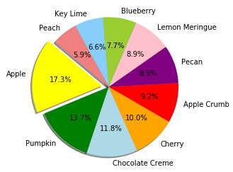
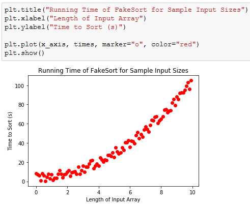
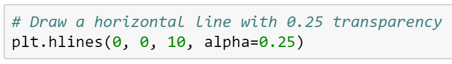
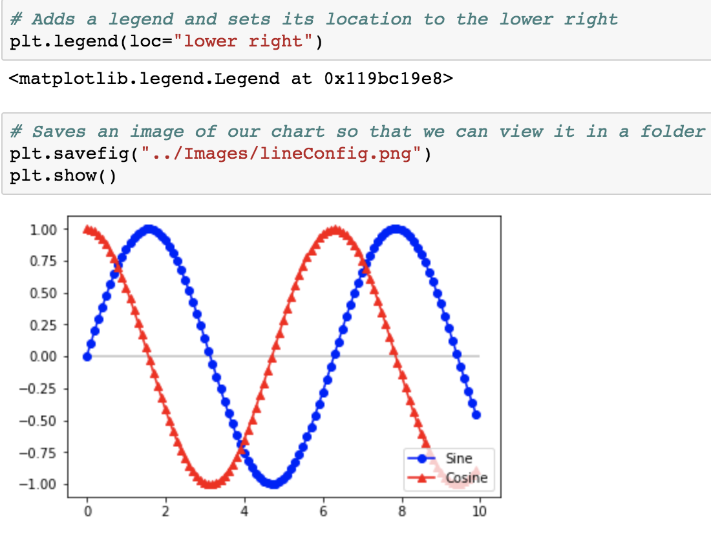
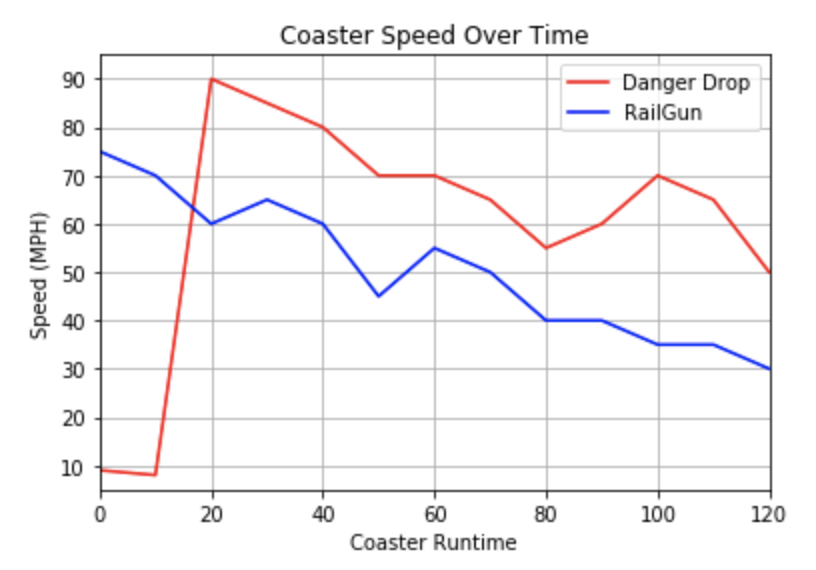
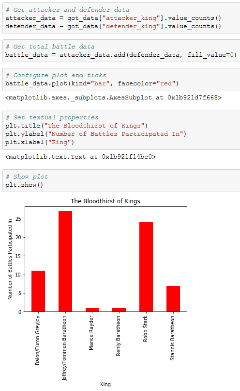
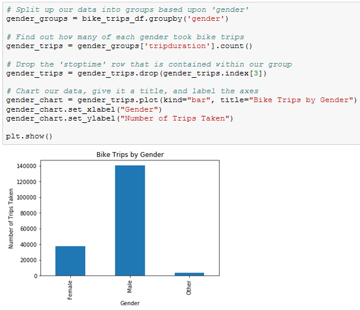
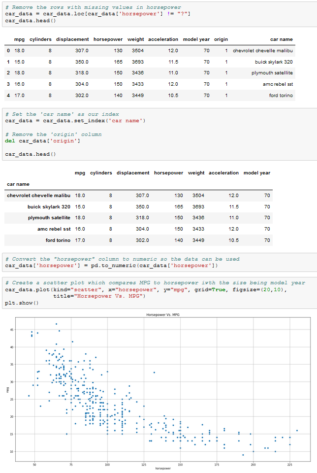
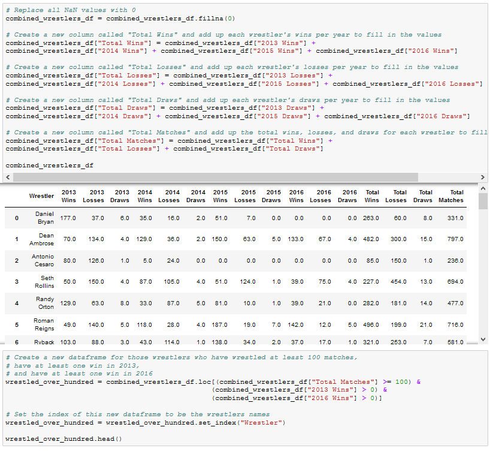

# Module 5: Virtual Class (Required) Lesson Plan

## Overview

Today's Virtual Class (Required) lesson will review the matplotlib library, how to create multiple types of charts in matplotlib, how to format charts, and how to create charts from Pandas. This lesson builds on the weekly materials covered in "Module 5: PyBer" to cement and extend the topics covered in new contexts.

## Learning Objectives

At the end of the session, learners will be able to:
 
* Determine the appropriate chart type for a given dataset
* Make charts with matplotlib, including
* Line charts
* Bar charts
* Pie charts
* Scatter plots
* Box-and-whisker plots
* Format charts made with matplotlib
* Plot charts using Pandas

- - -

### 0. Class Do: Interview Question Warm-Up (5 mins before class, first 2 mins of class) 

Open the [slideshow](https://docs.google.com/presentation/d/1VFM3ALnZJg_pNeAGUMO7oDX07V7SQYPxI1v8q240VNA/edit?usp=sharing) for today's class and begin the weekly presentation with the first slide.The first slide displays an interview question that a student may encounter based on the content of this week's content. 

**This week's question:** What are the benefits of data visualization?

Allow the question to be on the screen 5 mins prior to the start of class as students join the session. Allow the class 1 minute at the start of class to review, then you will ask for a student to volunteer their answer to the question. Next, offer the answer or a few approaches you would take for answering the question.

**Possible answers to this week's question:**
* Displaying a lot of information in an easy to understand format
* Telling a data story
* Making data accessible to laypeople
* Showing trends
* Showing relationships in data

### 1. Instructor Do: Temperature Check (15 mins)
Using the [Zoom Polling](https://support.zoom.us/hc/en-us/articles/213756303-Polling-for-Meetings) feature or a [Poll Everywhere](http://www.polleverywhere.com), launch a poll of the class to identify areas that they would like to review from the week's asynchronous content. 

**Poll Text:**

*Select all of the topics that you feel prepared to apply outside of the class from this week's lesson:*

* *Create Line Charts*
* *Create Bar Charts*
* *Create Scatter Plots*
* *Create Pie Charts*
* *Create Box-and-Whisker Charts*
* *Reading Box-and-Whisker Charts*
* *Chart selection*
* *Plotting with Pandas*
* *Chart Formatting*

Based on the results of the poll, advance to the correct slide for a review of the topics with the lowest scores. Choose 2 topics at minimum to review, or more as time permits to review. **Note: the ending activities are longer than usual, so be sure to allow enough time for them**

* Create Line Charts (Do activities in section **A**)
* Create Bar Charts (Do activities in section **A**)
* Create Scatter Plots (Do activities in section **A**)
* Create Pie Charts (Do activities in section **A**)
* Create and interpret Box-and-Whisker Charts (Do activities in section **D**)
* Chart selection (Do activities in section **A**)
* Plotting with Pandas (Do activities in section **C**)
* Chart Formatting (Do activities in section **B**)

It is anticipated that chart formatting will garner the most votes.

# A. Creating Charts (1:25 to 1:55)

### A1. Students Do: New Jersey Weather (0:15)

* Students will create a series of line plots using temperature data from New Jersey.

* Open up [A1-Stu_NJTemp/Solved/NJ_temp.ipynb](Activities/A1-Stu_NJTemp/Solved/NJ_temp.ipynb) within the Jupyter Notebook and run the code to show the end results of the application.

* **Instructions:**

  * Using the following data, plot the monthly averages for temperature in New Jersey.

    * Use the numeric value for months.

    * Average temperature per month in Fahrenheit: `[39, 42, 51, 62, 72, 82, 86, 84, 77, 65, 55, 44]`

  * Use list comprehension to convert the temperature to Celsius and plot that line as well.

  * Create a third plot that includes both lines.

* **Hints:**

  * The formula to convert Fahrenheit to Celsius: `(x-32) * 0.56`

  * See the [MatPlotLib Documentation](https://matplotlib.org/2.0.2/index.html) for more information regarding the PyPlot library

  * Also look into the [NumPy Documentation](https://docs.scipy.org/doc/numpy/reference/) for more information on the NumPy library

### A2. Instructor Do: Review New Jersey Weather (0:05)

* Open up [A1-Stu_NJTemp/nj_temp.ipynb](Activities/A1-Stu_NJTemp/Solved/NJ_temp.ipynb) within the Jupyter Notebook and go through the code line-by-line with the class, answering whatever questions they may have.

  * A list of numbers ranging from one to twelve are created using `np.arange(1,13,1)`. The parameters passed tell NumPy to start at one, finish before thirteen, and each value should be one greater than the last.

  * In order to create the Fahrenheit chart, simply pass the `x_axis` and `points` lists into `plt.plot()` and then run `plt.show()`

    

  * To convert the values within the `points` list to Celsius, use a list comprehension where each value in the initial list is passed through the following formula: `(x-32) * 0.56`

    

  * Showing both lines on a single chart is as simple as running the code for drawing both of the charts within the same cell and then using the `plt.show()` method.

### *A3. Instructor Do: Introduction to Matplotlib (0:10) (Optional)*

* If students need more practice with Matplotlib, do this optional activity.

* Explain that Matplotlib is one of the most popular Python charting libraries in use, and today's lesson focuses in particular on familiarizing students with the basics of a matplotlib module called PyPlot, which they can use to create simple charts quickly.

* Open and run [A2-Ins_BasicLineGraphs/ExponentialChart.ipynb](Activities/A2-Ins_BasicLineGraphs/Solved/exponential_chart.ipynb) within Jupyter Notebook to show students how PyPlot can be used to create an exponential line graph.

  * The NumPy library is oftentimes used alongside PyPlot. This package contains plenty of built-in methods which allow for simple scientific computing.

  * Explain that `np.arange(start, end, step)` creates a list of numbers from `start` to `end`, where each number in the list is `step` away from the next ones.

  * Make sure to point out how the `e_x` list is being created using a "list comprehension". List comprehensions allow lists to be created using mathematic formulae. For example, the one being used in this application, takes values from the `x_axis` list one at a time, finds the exponential of them, and stores the response within a list.

    

  * Explain that Matplotlib allows users to generate plots by setting one list as the x-axis and another as the y-axis. It really is as simple as calling `plt.plot()`, passing those two lists through as parameters, and then calling `plt.show()` afterwards to print the chart to the screen.

  * Matplotlib handles the details of painting charts to the screen, but the programmer has full control over each stage of the drawing process if they really need it. By using `plt.xlabel()` and `plt.ylabel`, for example, users can easily add axis titles to their charts as well.

    

* Open and run [A2-Ins_BasicLineGraphs/SinCos.ipynb](Activities/A2-Ins_BasicLineGraphs/Solved/sin_cos.ipynb) within Jupyter Notebook to show students how PyPlot can be used to create a plot with multiple lines as well.

  * Point out how `np.arange()`, `np.sin()`, and `np.cos()` are all being used in order to create the lists for the application's charts.

  * In order to chart multiple lines on the same chart, it is as simple as calling `plt.plot()` two times and providing PyPlot with different values.

    

  * Reassure students that, while this plot is very simple, it introduces all of the major tools required to build much "prettier" plots in the future.

* Remind students that visualizations of data are valuable for far more than aesthetics. Trends and "human" insights buried within complex data sets are often clearest when the data is visualized in some way.

  * Open the [Bay Area Weather blog post](https://blog.plon.io/tutorials/weather-data-for-san-francisco-bay-area-a-python-pandas-and-matplotlib-tutorial/), or just the [image](Images/01-temperature.png) and point out that the trend is clear from the graphic but would _not_ be obvious in a table.

    

### A4. Students Do: Bars Bar Chart (0:10)

* The class will now take some time to create a bar chart that visualizes the density of bars within major US cities.

* Open up [A3-Stu_PyBars/py_bars.ipynb](Activities/A3-Stu_PyBars/Solved/py_bars.ipynb) so that the class can see what chart they will be attempting to create.

  

* **Files:**

  * [A3-Stu_PyBars/py_bars.ipynb](Activities/A3-Stu_PyBars/Unsolved/py_bars.ipynb)

  * [Bars Bar Chart](Activities/A3-Stu_PyBars/Images/BarDensity.png)

* **Instructions:**

  * Using the file provided as a starter, create a bar chart that matches the image provided.

### A5. Everyone Do: Bars Bar Chart Review (0:05)

* Open up [A3-Stu_PyBars/py_bars.ipynb](Activities/A3-Stu_PyBars/Solved/py_bars.ipynb) within the Jupyter Notebook and go through the code line-by-line with the class, answering whatever questions they may have.

  * Focus in upon the ticks set for the bar chart in particular.

  * `plt.xlim()` is set to go from -0.75 to the length of the Y axes minus 0.25 so that there is a degree of space between the leftmost bar and the edge of the chart.

    

### *A6. Instructor Do: Bar Charts (0:05) (Optional)*

* Open the bar chart example within Jupyter Notebook: [A4-Ins_BarCharts/bar_chart.ipynb](Activities/A4-Ins_BarCharts/Solved/bar_chart.ipynb)

  * Explain that, when dealing with bar charts, it is necessary to provide the heights of each bar within an array.

  * The x-axis will also be an array whose length must equal that of the list of heights.

  * Instead of using `plt.plot()` bar charts are drawn using `plt.bar()`.

  * The `align` parameter for `plt.bar()` is center to center.

    

  * Explain that an additional aesthetic challenge unique to bar charts is aligning the tick locations on the x-axis and providing textual, rather than numeric, labels.

  * The `tick_locations` list created within this application places a tick for each `value` in the `x_axis`.

    

  * The `plt.xlim()` and `plt.ylim()` are set so that there is some space between the bars and the edge of the chart. This makes the chart look a little better aesthetically.

### A7. Students Do: Pies Pie Chart (0:10)

* The class will now take some time to create a pie chart that visualizes the favorite pies within the United States.

* Open up [A5-Stu_PyPies/py_pie.ipynb](Activities/A5-Stu_PyPies/Solved/py_pie.ipynb) so that the class can see what chart they will be attempting to create.

  

* **Files:**

  * [A5-Stu_PyPies/py_pie.ipynb](Activities/A5-Stu_PyPies/Unsolved/py_pie.ipynb)

  * [Pies Pie Chart](Activities/A5-Stu_PyPies/Images/PyPies.png)

* **Instructions:**

  * Using the file provided as a starter, create a pie chart that matches the image provided.

### A8. Everyone Do: Pies Pie Chart Review (0:05)

* Open up [A5-Stu_PyPies/py_pie.ipynb](Activities/A5-Stu_PyPies/Solved/py_pie.ipynb) within the Jupyter Notebook and go through the code line-by-line with the class, answering whatever questions they may have.

  * One of the things that makes this activity challenging is knowing what colors are available for use. Students can find a list of colors available to peruse [here](https://matplotlib.org/users/colors.html)

  * Pie charts are VERY easy to make since the editing of a chart only really requires the editing of values. The styling and aesthetics other than this are fairly uniform across charts.

    

### *A9. Instructor Do: Pie Charts (0:05) (Optional)*

* Open the pie chart example: [A6-Ins_PieCharts/pie_chart.ipynb](Activities/A6-Ins_PieCharts/Solved/pie_chart.ipynb)

  * Explain that the sizes of each wedge are passed into `plt.pie()` as an array. Lists containing the labels for each wedge and the colors for each wedge are also passed in.

  * Point out that the pie chart allows the user to choose a wedge to "explode," using the `explode` option. This will separate one wedge from the rest so that it is easier to examine.

  * Inside of the `plt.pie()` method, a parameter of `autopc="%1.1%%"` is being passed. This will automatically convert the values passed into percentages with one decimal place.

    

  * Explain that Matplotlib does not constrain pie charts to be circular — by default, they will be ovals if the window the plot lives in is not a square. This is why `plt.axis("equal")` is being passed.

    

  * Explain that there are additional configuration options available for improving the appearance of Matplotlib's pie charts should students desire to look into them.

### A10. Students Do: Scatter Py (0:10)

* The class will now take some time to create a scatter plot that visualizes ice cream sales in comparison to temperature increases.

* Open up [A7-Stu_ScatterPy/ice_cream_sales.ipynb](Activities/A7-Stu_ScatterPy/Solved/ice_cream_sales.ipynb) so that the class can see what chart they will be attempting to create.

  

* **Files:**

  * [A7-Stu_ScatterPy/ice_cream_sales.ipynb](Activities/A7-Stu_ScatterPy/Unsolved/ice_cream_sales.ipynb)

  * [IceCreamSales Chart](Activities/A7-Stu_ScatterPy/Images/IceCreamSales.png)

* **Instructions:**

  * Using the file provided as a starter, create a scatter plot that matches the image provided.

* **Bonus**

  * Create a new list called "scoop_price," fill it with values, and then set it so that the size of the dots are set according to those values.

### A11. Everyone Do: Scatter Py Review (0:05)

* Open up [A7-Stu_ScatterPy/ice_cream_sales.ipynb](Activities/A7-Stu_ScatterPy/Solved/ice_cream_sales.ipynb) within the Jupyter Notebook and go through the code line-by-line with the class, answering whatever questions they may have.

### *A12. Instructor Do: Scatter Plots (0:10) (Optional)*

* Finally, open the scatter plot example: [A8-Ins_ScatterPlots/scatter_plot.ipynb](Activities/A8-Ins_ScatterPlots/Solved/scatter_plot.ipynb)

  * Explain that this plot uses random data just so the class can avoid cluttering the example with Pandas cleanup — later activities will provide more realistic context.

  * Explain that generating scatter plots demands the simplest set of methods of all the charts so far. Simply take in two sets of data and pass them into `plt.scatter()`.

  * Call attention to the fact that the code can change the size of each dot by passing the `s=<LIST>` parameter. In this case, the values stored within `x_axis` will determine the size of a dot.

    

### A13. Students Do: PyPlot Practice (0:15)

* Use these PyPlot drilling exercises to give students more practice with PyPlot, but also to test their ability to determine what kind of plot fits a data set best.

* Do not open up any examples before slacking out the instructions for this activity. Part of the challenge is for the class to come up with what charts fit the data and, as such, providing them with a screenshot would give it all away.

* **File:**

  * [plot_drills.ipynb](Activities/A9-Stu_PlotsReview/Unsolved/plot_drills.ipynb)

* **Instructions:**

  * What kinds of plots match the datasets below?

  ```
  # DATASET 1
  gyms = ["Crunch", "Planet Fitness", "NY Sports Club", "Rickie's Gym"]
  members = [49, 92, 84, 53]

  # DATASET 2
  x_lim = 2 * np.pi
  x_axis = np.arange(0, x_lim, 0.1)
  sin = np.sin(x_axis)

  # DATASET 3
  gyms = ["Crunch", "Planet Fitness", "NY Sports Club", "Rickie's Gym"]
  members = [49, 92, 84, 53]
  colors = ["yellowgreen", "red", "lightcoral", "lightskyblue"]
  explode = (0, 0.05, 0, 0)

  # DATASET 4
  x_axis = np.arange(0, 10, 0.1)
  x_axis = np.arange(0, 10, 0.1)
  times = []
  for x in x_axis:
    times.append(x * x + np.random.randint(0, np.ceil(max(x_axis))))
  ```

  * Create a plot for each of the datasets above, making certain to provide each chart with a title and labels

### A14. Everyone Do: PyPlot Practice Review (0:05)

* Open up [A9-Stu_PlotsReview](Activities/A9-Stu_PlotsReview/Solved/plot_drills.ipynb) within the Jupyter Notebook and go through the code line-by-line with the class, answering whatever questions they may have and making certain to discuss the following points.

  * The first dataset is ideal for a bar chart since the programmer is provided with nothing but a list of strings - gym names - and a list of integers - gym memberships - that should be compared against one-another.

  * So as to ensure the graph is as aesthetically pleasing as possible, the tick locations for the X axis are modified so that they fall in the center of their associated bar when the bars are aligned to the edge of the chart. The limits of the X and Y axes are then also modified to ensure there is some separation between the bars and the edge of the chart.

    

  * The second dataset fits a line chart best since the values within the lists change over time in relation to one-another.

  * There is not as much aesthetic editing that needs to be done with this chart other than adding a horizontal line to the chart where the Y axis is equal to 0 so that it is easy to tell when a value is positive or negative.

    

  * While the third dataset obviously fits that which would be used for a pie chart, the only thing that differentiates it from the first is the inclusion of the "colors" list and "explode" tuple. Still, since pie charts are helpful when comparing parts of a whole, the pie chart provides a different perspective than the bar chart from earlier.

  * It is important to note how the axes are being set to "equal" so that the pie chart is circular and that the parameter of `autopct=%1.1%%` is passed into the `plt.pie()` method so as to convert the values within the "members" list into percentages with a single decimal point.

    

  * The final dataset compares the relationship between two lists with unique values. Because of this, a scatter plot is the ideal method through which to visualize the relationship.

  * Scatter plots require very little in the way of aesthetic styling and, as such, the chart really only needs to be drawn in order to look pleasing.

    

## B. Formatting Charts (0:35 to 0:50)

### B1. Students Do: Legendary Temperature (0:15)

* Students will now edit the line plots they created earlier so that these charts are more visually interesting.

* Encourage students to play with additional configuration options beyond those asked for. Slack out links to the Matplotlib API so that students can play around with the library when they finish the activity.

* Open up [avg_temp.png](Activities/B1-Stu_LegendaryTemperature/Images/avg_temp.png) so that the class can see what chart they will be attempting to create.

  

* **Files:**

  * [B1-Stu_LegendaryTemperature/legendary_temp.ipynb](Activities/B1-Stu_LegendaryTemperature/Unsolved/legendary_temp.ipynb)

  * [avg_temp.png](Activities/B1-Stu_LegendaryTemperature/Images/avg_temp.png)

* **Instructions:**

  * Modify the New Jersey temperature line charts from earlier so that they match the image provided.

  * Once the plot has been created, look through the [MatPlotLib Documentation](https://matplotlib.org/2.0.2/index.html) to see what additional formatting could be added to the chart.

### B2. Instructor Do: Review Legendary Temperature (0:05)

* Open up [B1-Stu_LegendaryTemperature/legendary_temp.ipynb](Activities/B1-Stu_LegendaryTemperature/Solved/legendary_temp.ipynb) within the Jupyter Notebook and go through the code line-by-line with the class, answering whatever questions they may have.

  * Make sure to discuss how both `fahrenheit` and `celsius` are followed by commas to set them as tuples. This is crucial since `plt.legend()` expects to be handed tuples within its `handles` parameter and would return an error otherwise.

  * The `loc` parameter of `plt.legend()` has been set to "best" within this application. This allows MatplotLib to decide where to place the legend so that it does not get in the way.

    

* Check with the class to see what interesting formatting options they uncovered during this activity and ask a couple of them to come up and explain their code to the class.

### *B3. Instructor Do: Configuring Line Plots (0:10) (Optional)*

* Point out that Matplotlib's basic line plots are rather bland.

  * Thankfully Matplotlib offers considerable control over the details of our plots' appearances and the easiest way to change the way things look is to use **keyword arguments** to configure the behavior of `plot`.

* Slack out the updated sin and cosine example titled [B2-Ins_ConfiguringLinePlots/line_config.ipynb](Activities/B2-Ins_ConfiguringLinePlots/Solved/line_config.ipynb) and open up the code within Jupyter Notebook.

  * Point out that, while not massively different aesthetically, this new version of the Sin/Cos plot does introduce some additional components.

  * `plt.hlines()` is used to draw a horizontal line. This method takes in three parameters: the Y value across which the line will be drawn, the X value where the line will start, and the X value where the line will end.

  * The transparency of the horizontal line can also be set using the `alpha=` keyword and passing a number between 0 and 1. This setting is possible with most MatplotLib plotting functions.

    

* Draw attention to the lines being drawn and set to `sin_handle,` and `cos_handle,` and explain:

  * `pyplot.plot` returns a list of the lines that were added to the plot.

  * This bit of code is using argument unpacking to select only the first line from that list of lines.

  * So, calling the `sine_handle` is a reference to the lines object.

  * `plt.plot()` can take in more parameters than just the X and Y values for the line being charted. For example, the markers for a plot can be set using `marker=`, the color of a plot can be set using `color=`, and the label for a line can be set using `label=`.

    

  * The `plt.legend()` method allows the user to create a legend for their chart. The `loc` argument is used to set the location of the legend on the chart.

  * While the `plt.show()` command has not changed, a new line called `plt.savefig()` has been added which will save a version of the chart to an external file. Simply pass the file path desired as a parameter to save the image.

    

* Explain that the different [markers](http://Matplotlib.org/api/markers_api.html) and [colors](http://Matplotlib.org/api/colors_api.html) are available in the documentation, which students are encouraged to peruse when building their plots.

### B4. Students Do: Coaster Speed (0:10)

* Students will now create a line chart that graphs the speed of a roller coaster over time. They will then style the chart and add some aesthetics to it.

* Open up [B3-Stu_RollerCoaster/coaster_speed.ipynb](Activities/B3-Stu_RollerCoaster/Solved/coaster_speed.ipynb) so that the class can see what chart they will be attempting to create.

  

* **Files:**

  * [Coaster Speed Chart](Activities/B3-Stu_RollerCoaster/Images/CoasterSpeed.png)

* **Instructions:**

  * Create a line chart with two plots using the following data:

    * `Danger Drop: [9, 8, 90, 85, 80, 70, 70, 65, 55, 60, 70, 65, 50]`

    * `RailGun: [75, 70, 60, 65, 60, 45, 55, 50, 40, 40, 35, 35, 30]`

  * Both coasters are 120 seconds long and the speed was measured every 10 seconds.

  * Apply styling and labels that match the image provided.

### B5. Instructor Do: Coaster Speed Review (0:05)

* Open up [B3-Stu_RollerCoaster/coaster_speed.ipynb](Activities/B3-Stu_RollerCoaster/Solved/coaster_speed.ipynb) within the Jupyter Notebook and go through the code line-by-line with the class, answering whatever questions they may have.

  * `plt.title()`, `plt.xlabel()`, and `plt.ylabel()` are used to set the title and axis labels.

  * The `plt.xlim()` and `plt.ylim()` are set so that there is as little empty space as possible on the chart whilst still making it understandable.

    

### *B6. Instructor Do: Aesthetics (0:05) (Optional)*

* Point out that the best plots, like the best code, are easy to read. Emphasize that this is different from being beautiful. Graphics need not be "artistic," but they should be easy to understand.

* Explain that some ways to improve readability include:

  * Adding labels to the x-axis

  * Adding labels to the y-axis

  * Adding titles to plots

  * Limiting the extent of the plot to bound the plot's data points

  * In some cases adding grids can also help but this is often discouraged in general

* Explain that adding labels ensures the graphic remains honest and easy to understand, even in cases where the visualization is not immediately transparent to most viewers — such as with, for example, [Sankey diagrams](https://en.wikipedia.org/wiki/Sankey_diagram).

* Explain that limiting the extent of the plot maximizes the [data-to-ink ratio](https://infovis-wiki.net/wiki/Data-Ink_Ratio), and constrains the plot to display only relevant information.

* Open up the [updated sine and cosine plot](Activities/B4-Ins_Aesthetics/Images/sin_cos_with_markers.png).

  * Point out that this is not yet "attractive," but is more readable than the previous plots, thanks to the labels and changes being made to the x-axis.

  * `plt.xlabel()`, `plt.ylabel()`, and `plt.title()` are fairly self-explanatory. Simply pass a string into them as a parameter and the labels and title will be drawn onto the chart.

  * `plt.xlim()` and `plt.ylim()` are used to set where the axes for the chart should begin/end. MatplotLib will naturally create charts with a lot of empty space and these methods can help to limit that.

  * `plt.grid()` is also fairly obvious. Through its usage, gridlines are added to the chart.

    

## C. Plotting with Pandas (1:20 to 1:25)

### C1. Instructor Do: Plotting Pandas Data	(0:10)

* Point out to students that in real applications, the data being used will likely come from a Pandas DataFrame since that library allows for such ample customization/cleaning of data sets.

  * Remind students that, when dealing with real data, analysts will typically spend a lot of time "cleaning" it prior to generating any graphics. It is only once the data is clean that they can create an accurate and effective plot.

  * The creators of Pandas realized this and, in a moment of pure genius, built MatplotLib methods into their library so as to allow data analysts to easily generate complex charts in very little time.

* Open and run [C1-Ins_PandasPlot](Activities/C1-Ins_PandasPlot/Solved/avg_state_rain.ipynb) within Jupyter Notebook to show students how Pandas can be used to create intricate plots and data visualizations using the values stored within DataFrames.

  * Point out that, using PyPlot, it took a lot of code to create a bar chart of average rainfall by state.

  * Scroll down to the "Using Pandas to Chart a DataFrame" section of the application and describe to the class how the original DataFrame is being cut down to only those values which the application should chart. The index for the DataFrame is then set to the "State" column so that Pandas will use these values later on.

  * `DataFrame.plot()` is called and the parameters `kind="bar"` and `figsize=(20,3)` are passed into it. This tells Pandas to create a new bar chart using the values stored within the DataFrame. The values stored within the index will be the labels for the X axis while the values stored within the other column will be used to plot the Y axis.

  * Point out to students how the bar chart produced is automatically styled. The header for the index is now the label for the X axis while the header for the other column has been placed inside of a legend.

  * The chart can still be edited just like any other kind of PyPlot as well. For example, the title for the chart can still be set using `plt.title()`.

    

  * Pandas will plot multiple columns so long as the DataFrame contains multiple columns of data within it.

  * It is also possible to modify a specific Pandas plot by storing the plot within a variable and then using built-in methods to modify it. For example: `PandasPlot.set_xticklabels()` will allow the user to modify the tick labels on the X axis without having to manually set the DataFrame's index.

    

  * If an individual wished to use a different plotting type, they would simply want to change the "kind" that is being passed as a parameter.

### C2. Students Do: Battling Kings (0:20)

* The class will now take some time in order to create a bar chart that visualizes what kings within the Game of Thrones universe have participated in the most battles. This means that students will need to clean up and analyze a Pandas DataFrame before creating their plot.

* Open up [C2-Stu_BattlingKings](Activities/C2-Stu_BattlingKings/Solved/battling_kings.ipynb) within the Jupyter Notebook and run the code to show the end results of the application.

  

* **Files:**

  * [battling_kings.ipynb](Activities/C2-Stu_BattlingKings/Unsolved/battling_kings.ipynb)

  * [got.csv](Activities/C2-Stu_BattlingKings/Unsolved/Resources/got.csv)

* **Instructions:**

  * Use Pandas to load the `got.csv` data set.

  * Create a Series containing the number of times each king was an attacker.

  * Create a Series containing the number of times each king was a defender.

  * Combine these two variables into a single Series. _Hint_: How should you combine these two Series? Can you add Series in Pandas?

  * Use your combined data to retrieve labels for your x-ticks.

  * Create a red bar chart, and set its x-tick labels appropriately.

  * Add a title and labels to your plot.

  * Display your plot. Who participated in the most battles? The least?

### C3. Everyone Do: Battling Kings Review (0:05)

* Open up [C2-Stu_BattlingKings](Activities/C2-Stu_BattlingKings/Solved/battling_kings.ipynb) within the Jupyter Notebook and go through the code line-by-line with the class, answering whatever questions they may have and making certain to discuss the following points.

  * Since the primary purpose of this chart will be to uncover which kings have participated in the most battles, it is crucial to collect the `value_counts()` of both the "attacking_king" and "defending_king" columns.

  * The values contained within these two Pandas Series should be added together in order to calculate the total battles each king was in. This should be done using `Series.add(OtherSeries, fill_value=0)` so that the two kings who have only been on the defending sides of battles will be added properly.

  * All that needs to be done from this point on is use `DataFrame.plot(kind="bar")` so as to create the plot desired.

    

### C4. Students Do: Bike Trippin (0:20)

* Students will now create a pair of charts based upon community bike data collected from Seattle, Washington. This activity will require them to create/analyze GroupBy objects before printing some visualizations of their findings to the screen.

* Open up [C3-Stu_BikeTrippin](Activities/C3-Stu_BikeTrippin/Solved/bike_trippin.ipynb) within the Jupyter Notebook and run the code to show the end results of the application.

  
  

* **Files:**

  * [bike_trippin.ipynb](Activities/C3-Stu_BikeTrippin/Unsolved/bike_trippin.ipynb)

  * [trip.csv](Activities/C3-Stu_BikeTrippin/Resources/trip.csv)

* **Instructions:**

  * Create a bar chart using Pandas and MatplotLib that visualizes how many individual bike trips were taken by each gender.

  * Create a pie graph using Pandas and MatplotLib that can be used to visualize the trip duration of a single bike split up by gender.

* **Hint:**

  * There is a buggy value stored within the "gender" column of the original DataFrame. In order to create an accurate chart, this value will need to be found and removed.

### C5. Everyone Do: Bike Trippin Review (0:05)

* Open up [C3-Stu_BikeTrippin](Activities/C3-Stu_BikeTrippin/Solved/bike_trippin.ipynb) within the Jupyter Notebook and go through the code line-by-line with the class, answering whatever questions they may have and making certain to discuss the following points.

  * For the bar chart, the original DataFrame is grouped by the values within the "gender" column and counted.

  * The Series returns with a Series containing a buggy value called "stoptime". This row in the Series must be dropped so that the data can be charted accurately.

  * The title for the chart is set within the `DataFrame.plot()` method while the X and Y labels are set using `PandasPlot.set_xlabel()` and `PandasPlot.set_ylabel()`

    

  * For the pie chart, the original DataFrame is grouped by both the "bikeid" and "gender" columns. When the sum analyses is performed, therefore, a DataFrame containing multiple indexes is returned so that the duration is calculated per gender per bike.

    

  * In order to create a chart based on one bike alone, `loc[]` must be used in order and a single "bikeid" must be passed. This returns a Series with only the "gender" column as the index and "tripduration" as the value.

  * When creating a pie chart, a Y value must be passed into the `plot()` method. This lets Pandas know what values should be set as labels.

  * The title for the pie chart is being dynamically set by concatenating strings.

    

### *C6. Instructor Do: Plotting Groups (0:05) (Optional)*

* While plotting DataFrames is impressive enough on its own, Pandas also includes methods that allow users to plot GroupBy objects. This allows data analysts to very easily create charts that based on summary data.

* Open up [C4-Ins_GroupPlots](Activities/C4-Ins_GroupPlots/Solved/plotting_groups.ipynb) within Jupyter Notebook and run through the code with the class.

  * The data being accessed and utilized within this example takes used car data from Germany and thus allows users to determine what categories influence the pricing of a car.

  * Within this application, the original DataFrame is grouped by the values contained within the "maker" column. Those values are then counted and eventually charted using Pandas.

  * When charting a GroupBy element, some analysis must have been performed beforehand. Without performing some kind of analysis, the chart would simply look the same as if the original DataFrame had been plotted.

    

### C7. Students Do: Miles Per Gallon (0:15)

* The class will now take some time to create a scatter plot using vehicle data, Pandas, and MatplotLib.

* Open up [06-Stu_MilesPerGallon](Activities/C5-Stu_MilesPerGallon/Solved/mpg.ipynb) within the Jupyter Notebook and run the code to show the end results of the application.

  

* **Files:**

  * [mpg.ipynb](Activities/C5-Stu_MilesPerGallon/Solved/mpg.ipynb)

  * [MPG.csv](Activities/C5-Stu_MilesPerGallon/Resources/mpg.csv)

* **Instructions:**

  * Create a scatter plot using the data provided, Pandas, and MatplotLib which compares the MPG of a vehicle with its horsepower.

### C8. Everyone Do: Miles Per Gallon Review (0:05)

* Open up [C5-Stu_MilesPerGallon](Activities/C5-Stu_MilesPerGallon/Solved/mpg.ipynb) within the Jupyter Notebook and go through the code line-by-line with the class, answering whatever questions they may have and making certain to discuss the following points.

  * There are quite a few rows in the original dataset that include missing values. These rows are filtered out using a `loc[]` filter that looks for any rows that do not contain a "?" value.

  * The data stored within the "horsepower" column is not numeric by default. This is due to the "?" values that were there and, as such, `pandas.to_numeric()` must be used to convert the column into a usable format.

  * The `x` and `y` parameters in `DataFrame.plot()` allow users to specify which columns they would like to chart. This allows the user to create graphs without having to filter the DataFrame down to only two columns.

    

## D. Outliers and Box-and-Whisker Plots (0:45)

### D1. Instructor Do: Misleading Statistics & Quartiles (0:10)

* Point out again that extreme values in a data set can skew descriptive statistics like the mean.

  * Remind students that extreme values are known as **outliers**.

* Explain that we do not necessarily have to keep these points — if it makes sense, we can _sometimes_ choose to ignore them.

* Explain that extreme values often do not describe the data, and are the result of factors other than what we are trying to understand.

  * Explain that this is not _always_ the case, however, so we cannot remove _all_ extreme values _all_ of the time.

* Explain that it is okay to remove outliers if any of the following are true.

  * The data is due to bad measurements. If your data includes reaction time measurements, and one of the values is 1ms, you should probably remove it — human reaction times are _at least_ 100ms, so 1ms is clearly bad data.

  * If the outliers _create_ trends that wouldn't exist without them, you _should_ drop them.

    

* The outliers do _not_ change your results. In this case, it is okay to drop them, but it is best to make a note of having done so.

  

* If your outlier _does_ change your results, you _should not_ drop it.

  

* The above plots are from an article on removing outliers on [The Analysis Factor](http://www.theanalysisfactor.com/outliers-to-drop-or-not-to-drop/).

* Point out that interesting data sets are generally to large to apply these rules by hand, but that they are good guidelines to use after graphing data to determine if there are any points that should obviously be considered for removal.

* Point out that, while useful, these essentially graphical guidelines are a little "fuzzy".

* Explain that there are multiple ways to remove outliers from data sets that rely on "hard numbers".

  * Explain that the simplest of these relies on removing data that is "far away" from the median.

  * Explain that, to quantify this, we need to understand the idea of **quartiles**.

* Explain that **quartiles** are a way to divide our data into well-defined regions.

  * Remind students that the median is the midpoint of a data set — it divides the list in two.

* Explain that we can think of everything above the median and everything below the median as two separate data sets.

* Explain that the median of the upper list is called the **upper quartile**, and the median of the lower list is called the **lower quartile**.

* Explain that a simple but common way to remove outliers is to throw away anything _above_ the upper quartile, and everything _below_ the lower quartile.

* Open up the example file: [D1-Ins_Quartiles_and_Outliers/samples.ipynb](Activities/D1-Ins_Quartiles_and_Outliers/Solved/samples.ipynb).

* Explain that the median, lower quartile, and upper quartile of this data set are 6, 4, and 8, respectively.

  

* Finally, explain that subtracting the lower quartile from the upper quartile gives us the **interquartile range**, which is another measure of how "spread out" a data set is.

### D2. Students Do: Handling Outliers (0:25)

* **Files**:

  * [README](Activities/D2-Stu_Quartiles_and_Outliers/README.md).

  * [04-Stu_Quartiles_and_Outliers/quartile_outliers.ipynb](Activities/D2-Stu_Quartiles_and_Outliers/Unsolved/quartile_outliers.ipynb)

  * [04-Stu_Quartiles_and_Outliers/stats.py](Activities/D2-Stu_Quartiles_and_Outliers/Unsolved/stats.py)

* **Instructions:**

  * Take a look at the list in the in the `quartile_outliers` notebook. Identify the median, upper quartile, and lower quartiles by hand.

* Use code to determine the lower and upper quartiles and be sure to account for both odd and even lengths of a data set.

  * Reference <https://en.wikipedia.org/wiki/Quartile> to choose a method for best handling this.

  * Use [numpy.percentile](https://het.as.utexas.edu/HET/Software/Numpy/reference/generated/numpy.percentile.html) to help with the calculations.

* The difference between the upper and lower quartile is called the **interquartile range**, or IQR.

  * Like the standard deviation, the IQR describes how "spread out" the data set is.

  * Calculate the IQR for this list.

* Determine the outliers

  * Lower outliers are points that fall below the result of the equation Q1 - 1.5 \* IQR

  * Upper outliers are points that above the result of the equation Q3 + 1.5 \* IQR

* * Finally create a box plot of that data.

### D3. Instructor Do: Review Activity (0:10)

* Open up the solution to the previous activity: [D2-Stu_Quartiles_and_Outliers/quartile_outliers.ipynb](Activities/D2-Stu_Quartiles_and_Outliers/Solved/quartile_outliers.ipynb).

* Explain that, for the example list, the median is 14.55.

* Explain that, using numpy the percentile can be found to be 11.474 and 15.075.

* Explain that the **interquartile range** is simply the difference between these two numbers: 3.6.

  * Explain that the interquartile range measures spread, similar to standard deviation, but is less susceptible to outliers.

* Explain the boundaries can be found with the formulas `Q1 - 1.5 * IQR` and `Q3 + 1.5 * IQR`

* Explain that to check for outliers see what values fall outside the boundaries.

* Finally, explain that a boxplot can be used to visualize the quartiles and the outliers. The middle, box, section represents the interquartile range. The outliers are represented by the circles that are above and below the whiskers of the boxplot.

  

- - -
### Break (0:05)
- - -

### 2. Groups Do: Winner Wrestling - Part I (0:15)

* The rest of class will be dedicated to creating a plot using Pandas and MatplotLib that allows its viewers to visualize the recent career of professional wrestlers.

* This mini-project has been broken down into three parts and was designed for students to work alongside each other in groups.

* In this first part, students will take four separate CSV files and merge them together. They will then need to rename and style the columns so that they reflect the data properly.

* Open up [01-Stu_WinnerWrestling-Part1](Activities/01-Stu_WinnerWrestling-Part1/Solved/winning_wrestlers.ipynb) within the Jupyter Notebook and run the code to show the end results of the application.

  

* **Files:**

  * [winning_wrestlers.ipynb](Activities/01-Stu_WinnerWrestling-Part1/Solved/winning_wrestlers.ipynb)
  * [WWE-Data-2013.csv](Activities/01-Stu_WinnerWrestling-Part1/Resources/WWE-Data-2013.csv)
  * [WWE-Data-2014.csv](Activities/01-Stu_WinnerWrestling-Part1/Resources/WWE-Data-2014.csv)
  * [WWE-Data-2015.csv](Activities/01-Stu_WinnerWrestling-Part1/Resources/WWE-Data-2015.csv)
  * [WWE-Data-2016.csv](Activities/01-Stu_WinnerWrestling-Part1/Resources/WWE-Data-2016.csv)

* **Instructions:**

  * The instructions for this activity are contained in the unsolved Jupyter notebook file.

### 3. Everyone Do: Winner Wrestling - Part I Review (0:05)

* Open up [01-Stu_WinnerWrestling-Part1](Activities/01-Stu_WinnerWrestling-Part1/Solved/winning_wrestlers.ipynb) within the Jupyter Notebook and go through the code line-by-line with the class, answering whatever questions they may have and making certain to discuss the following points.

  * The DataFrames should be merged together on the "Wrestler" column using an outer join. This ensures that no data will be lost even if the wrestler is unique to a single CSV.

  * As DataFrames are merged, columns should be renamed so that it is clear what year the wins, losses, and draws are from.

  * While it is possible to merge all of the DataFrames together using one incredibly long series of nested merge statements, it is far simpler to merge the DataFrames together a pair at a time. This allows the programmer to modify columns as they go along and lessens the risk of naming a column incorrectly.

    

### 4. Groups Do: Winner Wrestling - Part II (0:10)

* In this second part, groups will create new columns for their DataFrame which will inform readers of how many matches a wrestler has won, lost, drawn, and taken part in over the course of their career.

* Open up [02-Stu_WinnerWrestling-Part2](Activities/02-Stu_WinnerWrestling-Part2/Solved/winning_wrestlers.ipynb) within the Jupyter Notebook and run the code to show the end results of the application.

  

* **Files:**

  * [winning_wrestlers.ipynb](Activities/01-Stu_WinnerWrestling-Part1/Solved/winning_wrestlers.ipynb)
  * [WWE-Data-2013.csv](Activities/01-Stu_WinnerWrestling-Part1/Resources/WWE-Data-2013.csv)
  * [WWE-Data-2014.csv](Activities/01-Stu_WinnerWrestling-Part1/Resources/WWE-Data-2014.csv)
  * [WWE-Data-2015.csv](Activities/01-Stu_WinnerWrestling-Part1/Resources/WWE-Data-2015.csv)
  * [WWE-Data-2016.csv](Activities/01-Stu_WinnerWrestling-Part1/Resources/WWE-Data-2016.csv)

* **Instructions:**

  * The instructions for this activity are contained within the unsolved version.

### 5. Everyone Do: Winner Wrestling - Part II Review (0:05)

* Open up [02-Stu_WinnerWrestling-Part2](Activities/02-Stu_WinnerWrestling-Part2/Solved/winning_wrestlers.ipynb) within the Jupyter Notebook and go through the code line-by-line with the class, answering whatever questions they may have and making certain to discuss the following points.

  * In order to calculate the total number of wins, losses, or draws simply add up the values within the corresponding columns for each wrestler and place the output within a new column.

  * To calculate the total number of matches, simply add up the total wins, losses, and draws for each wrestler and place the output within a new column.

  * To filter out those wrestlers who have not wrestled more than 100 matches, simply use a `loc[]` filter and check that the "Total Matches" column is greater than or equal to 100.

    

### 6. Groups Do: Winner Wrestling - Part III (0:15)

* In this final part, the class will take the DataFrame they created and, using MatplotLib, chart the number of wins and losses an individual wrestler had over the course of their recent career.

* Open up [03-Stu_WinnerWrestling-Part3](Activities/03-Stu_WinnerWrestling-Part3/Solved/winning_wrestlers.ipynb) within the Jupyter Notebook and run the code to show the end results of the application.

  

* **Files:**

  * [winning_wrestlers.ipynb](Activities/03-Stu_WinnerWrestling-Part3/Solved/winning_wrestlers.ipynb)
  * [WWE-Data-2013.csv](Activities/03-Stu_WinnerWrestling-Part3/Resources/WWE-Data-2013.csv)
  * [WWE-Data-2014.csv](Activities/03-Stu_WinnerWrestling-Part3/Resources/WWE-Data-2014.csv)
  * [WWE-Data-2015.csv](Activities/03-Stu_WinnerWrestling-Part3/Resources/WWE-Data-2015.csv)
  * [WWE-Data-2016.csv](Activities/03-Stu_WinnerWrestling-Part3/Resources/WWE-Data-2016.csv)

* **Instructions:**

  * The instructions for this activity are contained within the unsolved version.

### 7. Everyone Do: Winner Wrestling - Part II Review (0:05)

* Open up [03-Stu_WinnerWrestling-Part3](Activities/03-Stu_WinnerWrestling-Part3/Solved/winning_wrestlers.ipynb) within the Jupyter Notebook and go through the code line-by-line with the class, answering whatever questions they may have and making certain to discuss the following points.

  * Inputs can still function within Jupyter Notebook. Whenever the cell containing the input line is run, a prompt will be printed within the space beneath it and will allow for a user to add in their response.

  * Two Series must be created for the graph using `loc[]` filtering. Both look for the row with a wrestler name equal to that which the user inputted. The first Series takes all of the values in the "Wins" columns whilst the second Series takes all of the values in the "Losses" columns.

  * The "years" list that will serve at the chart's X axis can be made manually since the years are consistent and known to the programmer.

  * While the `Series.plot()` method could theoretically be used to create both the "Wins" and "Losses" plots, since the data is stored within different data types it is actually easier to use the `plt.plot()` method instead.

    